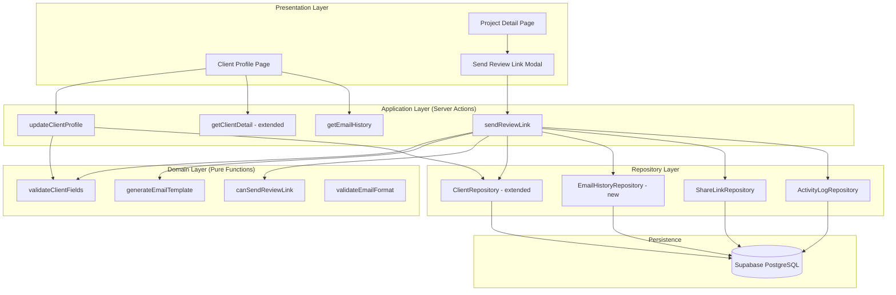
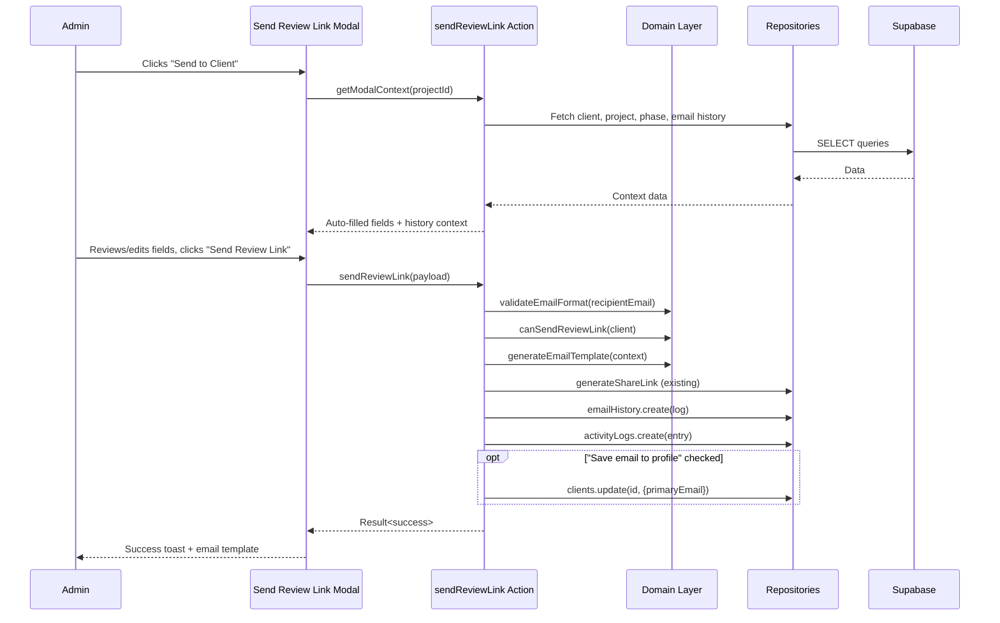

# Design Document: Client CRM & Review Links

## Overview

This feature extends the existing Client entity into a lightweight CRM profile and replaces the immediate share-link generation flow with a professional email-based review link delivery workflow. The design adds CRM fields to the `clients` table, introduces a `client_email_history` table for communication tracking, and builds a confirmation modal that lets admins verify recipients, customize messages, and track send history — all before the review link is delivered.

The architecture follows the project's established layered pattern: pure domain types and validation functions, repository interfaces for persistence, Server Actions for mutations, and React client components for the UI.

### Key Design Decisions

1. **Extend rather than replace** — The existing `clients` table gains new nullable columns (no breaking migration). The `Client` interface extends with optional CRM fields.
2. **Email generation, not sending** — The system generates a professional email template and provides a "mailto:" link or clipboard copy. Actual SMTP delivery is out of scope for v1 (can be added via Resend/SendGrid later). The `delivery_status` field defaults to `'sent'` to track intent.
3. **Modal replaces immediate link generation** — The "Send to Client" button opens a confirmation modal instead of instantly generating and copying a share link. The share link is still generated (reusing existing `generateShareLink`), but delivery is confirmed through the modal.
4. **Append-only email history** — Email logs are immutable audit records, similar to how `activity_logs` work.

## Architecture



### Data Flow: Send Review Link



## Components and Interfaces

### Domain Layer Extensions

```typescript
// src/lib/domain/types.ts — Extended Client interface
export type PreferredContactMethod = 'email' | 'phone' | 'other';

export interface Client {
  id: UUID;
  ownerId: UUID;
  name: string;
  status: ClientStatus;
  deletedAt: ISOTimestamp | null;
  createdAt: ISOTimestamp;
  // CRM extensions (all nullable for backward compatibility)
  fullName: string | null;
  businessName: string | null;
  primaryEmail: string | null;
  secondaryEmail: string | null;
  phone: string | null;
  website: string | null;
  location: string | null;
  preferredContactMethod: PreferredContactMethod;
  notes: string | null;
}

// New type for email history
export type EmailDeliveryStatus = 'sent' | 'failed' | 'pending';

export interface ClientEmailHistory {
  id: UUID;
  clientId: UUID;
  projectId: UUID;
  phaseId: UUID | null;
  recipientEmail: string;
  subject: string;
  message: string;
  sentBy: UUID;
  sentAt: ISOTimestamp;
  deliveryStatus: EmailDeliveryStatus;
}
```

### Domain Pure Functions

```typescript
// src/lib/domain/client-crm.ts

/** Validate email format (RFC 5322 simplified). */
export function validateEmailFormat(email: string): Result<string, AppError>;

/** Validate all client CRM fields. Returns field-level errors. */
export function validateClientFields(fields: Partial<ClientCRMInput>): Result<void, ValidationError>;

/** Guard: ensure a client can receive review link emails. */
export function canSendReviewLink(client: Client): Result<void, AppError>;

/** Generate the email template body from context. */
export function generateEmailTemplate(context: EmailTemplateContext): EmailTemplate;

/** Generate the auto-filled email subject. */
export function generateEmailSubject(projectName: string, phaseTitle?: string): string;
```

### Repository Layer Extensions

```typescript
// src/lib/repositories/interfaces.ts — additions

export type ClientPatch = Partial<Pick<Client,
  | 'name' | 'status' | 'deletedAt'
  | 'fullName' | 'businessName' | 'primaryEmail' | 'secondaryEmail'
  | 'phone' | 'website' | 'location' | 'preferredContactMethod' | 'notes'
>>;

export type NewClientEmailHistory = Omit<ClientEmailHistory, 'id'>;

export interface EmailHistoryRepository {
  create(input: NewClientEmailHistory): Promise<ClientEmailHistory>;
  findById(id: UUID): Promise<ClientEmailHistory | null>;
  listByClient(clientId: UUID, limit?: number): Promise<ClientEmailHistory[]>;
  listByProject(projectId: UUID, limit?: number): Promise<ClientEmailHistory[]>;
  countByClient(clientId: UUID): Promise<number>;
  lastSentForClientProject(clientId: UUID, projectId: UUID): Promise<ClientEmailHistory | null>;
}
```

### Server Actions

```typescript
// src/lib/actions/review-links.ts

/** Get context for the Send Review Link modal. */
export async function getReviewLinkModalContext(
  projectId: string,
  phaseId?: string
): Promise<Result<ReviewLinkModalContext, AppError>>;

/** Send review link: generate share link + log email history + activity log. */
export async function sendReviewLink(
  input: SendReviewLinkInput
): Promise<Result<SendReviewLinkResult, AppError>>;

// src/lib/actions/client-profile.ts

/** Update client CRM profile fields. */
export async function updateClientProfile(
  clientId: string,
  fields: ClientProfileInput
): Promise<Result<Client, AppError | ValidationError>>;

/** Get extended client detail with CRM fields, projects, email history. */
export async function getClientProfileDetail(
  clientId: string
): Promise<ClientProfileDetailData | null>;
```

### UI Components

| Component | Location | Purpose |
|-----------|----------|---------|
| `SendReviewLinkModal` | `src/components/review-link/SendReviewLinkModal.tsx` | Confirmation modal with auto-filled fields, email preview, and send actions |
| `EmailPreview` | `src/components/review-link/EmailPreview.tsx` | Formatted preview of how the email will appear to the client |
| `ClientProfileSections` | `src/app/(admin)/clients/[id]/sections/` | Card-based sections: Overview, Contact, Projects, Sign-offs, Ideas, Activity, Notes |
| `EmailHistoryTable` | `src/components/email-history/EmailHistoryTable.tsx` | IndexTable showing email history records |
| `ContactInfoCard` | `src/components/client/ContactInfoCard.tsx` | Editable contact information card |

#### Send Review Link Modal Details

The modal contains:
- Client Name (auto-filled, read-only display)
- Recipient Email (editable, auto-filled from client.primaryEmail)
- CC Email (optional)
- Email Subject (editable, auto-generated default)
- Custom Message (textarea, optional override)
- Review Link Preview (generated URL, with copy button)
- "Save changed email to client profile" checkbox (shown when email differs)
- Email preview panel (collapsible, shows formatted template)
- Context info: last sent date, total sent count, email-differs notice
- Actions: Cancel, Copy Review Link, Send Test Email, Send Review Link

#### Enhanced Client Profile Page

The client detail page at `/clients/[id]` will be restructured into card sections:

1. **Overview Card** — Name, business, status badge, created date
2. **Contact Information Card** — Email, phone, website, location, preferred method
3. **Projects Card** — IndexTable of linked projects with status badges
4. **Sign-offs Card** — Pending review count, approval history summary
5. **Email History Card** — IndexTable of sent emails (date, project, subject, status)
6. **Notes Card** — Editable text area for admin notes (max 5000 chars)
7. **Activity Log Card** — Chronological feed of all interactions

## Data Models

### Database Schema Extension

#### 1. Extend `clients` table

```sql
ALTER TABLE public.clients
  ADD COLUMN full_name text DEFAULT NULL,
  ADD COLUMN business_name text DEFAULT NULL,
  ADD COLUMN primary_email text DEFAULT NULL,
  ADD COLUMN secondary_email text DEFAULT NULL,
  ADD COLUMN phone text DEFAULT NULL,
  ADD COLUMN website text DEFAULT NULL,
  ADD COLUMN location text DEFAULT NULL,
  ADD COLUMN preferred_contact_method text NOT NULL DEFAULT 'email'
    CHECK (preferred_contact_method IN ('email', 'phone', 'other')),
  ADD COLUMN notes text DEFAULT NULL
    CHECK (notes IS NULL OR char_length(notes) <= 5000);
```

#### 2. Create `client_email_history` table

```sql
CREATE TABLE public.client_email_history (
  id uuid PRIMARY KEY DEFAULT gen_random_uuid(),
  client_id uuid NOT NULL REFERENCES public.clients(id) ON DELETE CASCADE,
  project_id uuid NOT NULL REFERENCES public.projects(id) ON DELETE CASCADE,
  phase_id uuid REFERENCES public.phases(id) ON DELETE SET NULL,
  recipient_email text NOT NULL,
  subject text NOT NULL,
  message text NOT NULL,
  sent_by uuid NOT NULL REFERENCES public.users(id) ON DELETE CASCADE,
  sent_at timestamptz NOT NULL DEFAULT now(),
  delivery_status text NOT NULL DEFAULT 'sent'
    CHECK (delivery_status IN ('sent', 'failed', 'pending'))
);

CREATE INDEX idx_email_history_client ON public.client_email_history(client_id);
CREATE INDEX idx_email_history_project ON public.client_email_history(project_id);
CREATE INDEX idx_email_history_sent_at ON public.client_email_history(sent_at DESC);
```

#### 3. Row Level Security

```sql
ALTER TABLE public.client_email_history ENABLE ROW LEVEL SECURITY;

CREATE POLICY "Users can manage email history for their own clients"
  ON public.client_email_history
  FOR ALL
  USING (
    sent_by = auth.uid()
    OR EXISTS (
      SELECT 1 FROM public.clients
      WHERE clients.id = client_email_history.client_id
        AND clients.owner_id = auth.uid()
    )
  );
```

### TypeScript ↔ Database Column Mapping

| Database Column | Domain Field | Type |
|---|---|---|
| `clients.full_name` | `Client.fullName` | `string \| null` |
| `clients.business_name` | `Client.businessName` | `string \| null` |
| `clients.primary_email` | `Client.primaryEmail` | `string \| null` |
| `clients.secondary_email` | `Client.secondaryEmail` | `string \| null` |
| `clients.phone` | `Client.phone` | `string \| null` |
| `clients.website` | `Client.website` | `string \| null` |
| `clients.location` | `Client.location` | `string \| null` |
| `clients.preferred_contact_method` | `Client.preferredContactMethod` | `PreferredContactMethod` |
| `clients.notes` | `Client.notes` | `string \| null` |
| `client_email_history.client_id` | `ClientEmailHistory.clientId` | `UUID` |
| `client_email_history.project_id` | `ClientEmailHistory.projectId` | `UUID` |
| `client_email_history.phase_id` | `ClientEmailHistory.phaseId` | `UUID \| null` |
| `client_email_history.recipient_email` | `ClientEmailHistory.recipientEmail` | `string` |
| `client_email_history.subject` | `ClientEmailHistory.subject` | `string` |
| `client_email_history.message` | `ClientEmailHistory.message` | `string` |
| `client_email_history.sent_by` | `ClientEmailHistory.sentBy` | `UUID` |
| `client_email_history.sent_at` | `ClientEmailHistory.sentAt` | `ISOTimestamp` |
| `client_email_history.delivery_status` | `ClientEmailHistory.deliveryStatus` | `EmailDeliveryStatus` |

### Extended Activity Type

```typescript
// Addition to ActivityType union in types.ts
export type ActivityType =
  | 'comment_created'
  | 'approval_created'
  | 'phase_status_changed'
  | 'review_link_sent';  // NEW
```

## Correctness Properties

*A property is a characteristic or behavior that should hold true across all valid executions of a system — essentially, a formal statement about what the system should do. Properties serve as the bridge between human-readable specifications and machine-verifiable correctness guarantees.*

### Property 1: Client profile data round-trip

*For any* valid client profile data (fullName, businessName, primaryEmail, secondaryEmail, phone, website, location, preferredContactMethod, notes), persisting it via the repository and reading it back should produce an identical record with all fields preserved.

**Validates: Requirements 1.1**

### Property 2: Email validation correctness

*For any* string, the `isValidEmail` function should accept it if and only if it matches a valid email format (contains exactly one `@`, has a non-empty local part, and a domain with at least one dot). This applies uniformly to both primaryEmail and secondaryEmail fields.

**Validates: Requirements 1.3, 1.4**

### Property 3: Preferred contact method enum enforcement

*For any* string, `validateClientFields` should accept it as `preferredContactMethod` if and only if it is one of `'email'`, `'phone'`, or `'other'`.

**Validates: Requirements 1.5**

### Property 4: Notes length boundary

*For any* string provided as `notes`, `validateClientFields` should reject it if its character length exceeds 5000, and accept it (or accept null) otherwise.

**Validates: Requirements 1.6**

### Property 5: Email template includes all input data

*For any* valid `EmailTemplateInput` (clientFullName, projectName, phaseName, reviewUrl, customMessage, adminName), the output `EmailContent` should contain the clientFullName in a greeting, the projectName, the reviewUrl as a link, the adminName in the sign-off, and the customMessage when provided. When phaseName is provided, it should also appear in the output.

**Validates: Requirements 6.1, 6.2, 6.3, 6.4, 6.5**

### Property 6: Default subject generation contains project and phase context

*For any* projectName string and optional phaseName string, `generateEmailSubject(projectName, phaseName)` should produce a string containing the projectName. When phaseName is provided, the subject should also contain the phaseName.

**Validates: Requirements 4.6**

### Property 7: Review URL contains token

*For any* share link token (string of ≥ 32 URL-safe characters), the constructed review URL should contain that token and be a valid URL path.

**Validates: Requirements 4.7**

### Property 8: Email history storage round-trip

*For any* valid `NewClientEmailHistory` record (clientId, projectId, phaseId, recipientEmail, subject, message, sentBy, sentAt, deliveryStatus), creating it via the EmailHistoryRepository and reading it back by ID should produce a record with all fields preserved.

**Validates: Requirements 7.2, 8.1**

### Property 9: Email history query completeness

*For any* set of N email history entries associated with a given clientId (or projectId), querying `listByClient(clientId)` (or `listByProject(projectId)`) should return exactly N results, and the returned set should contain all inserted records.

**Validates: Requirements 8.3, 8.4**

### Property 10: Archived client lifecycle guard round-trip

*For any* client with status `'archived'`, `canSendReviewLink(client)` should return an error. After restoring the same client to status `'active'`, `canSendReviewLink(client)` should return ok.

**Validates: Requirements 10.1, 10.5**

### Property 11: Conditional email profile update

*For any* email address that differs from the client's current primaryEmail, when `saveEmailToProfile` is true, the `sendReviewLink` action should update the client record's primaryEmail to the new address. When `saveEmailToProfile` is false, the client's primaryEmail should remain unchanged.

**Validates: Requirements 5.5, 9.4**

### Property 12: Auto-fill inheritance from client to project context

*For any* client with a non-null primaryEmail and fullName, when a project linked to that client is used in the send flow, the auto-filled recipientEmail should equal the client's primaryEmail and the auto-filled clientName should equal the client's fullName.

**Validates: Requirements 3.3, 4.4, 4.5**

### Property 13: Email-differs notice detection

*For any* pair of email strings (enteredEmail, clientPrimaryEmail), a difference notice should be shown if and only if the entered email is not equal (case-insensitive) to the client's primary email.

**Validates: Requirements 13.5**

## Error Handling

### Error Categories

| Error Type | Trigger | User-Facing Message | Recovery |
|---|---|---|---|
| `unauthorized` | No authenticated session | "You must be signed in to perform this action." | Redirect to login |
| `forbidden` | Archived client / deleted profile | "Cannot send review links to archived clients." | Show status, offer restore |
| `not_found` | Client/project/phase doesn't exist | "Project not found." | Navigate back |
| `validation` | Invalid email format, notes too long | Field-specific messages | Highlight invalid fields |
| `invalid_state` | No valid recipient email | "A valid recipient email is required." | Focus email field |
| `internal` | Database/network failure | "Failed to send review link. Please try again." | Retry button |

### Error Handling Strategy

1. **Domain validation errors** — Returned as `Result<void, ValidationError>` with field-level messages. UI surfaces them inline next to the offending field.
2. **Lifecycle guard errors** — Returned as `Result<void, AppError>` with `forbidden` code. UI shows a Banner explaining why the action is blocked.
3. **Infrastructure errors** — Caught in try/catch around repository calls. Mapped to `AppError` with `internal` code. UI shows a Toast with retry guidance.
4. **Partial success** — If share link generation succeeds but email history logging fails, the share link is still valid. The admin is notified of partial success and can retry the log.

### Graceful Degradation

- If the email dispatch service is unavailable (future SMTP integration), the system logs the email as `'pending'` status and shows a warning. The review link is still generated and copyable.
- If the client has no `primaryEmail`, the modal opens with an empty field and a warning banner. The admin can manually enter an address.
- If the project has no linked client, the modal still opens with empty client fields. The admin must provide all details manually.

## Testing Strategy

### Property-Based Tests

The feature's pure domain functions are well-suited for property-based testing:

- **Library**: [fast-check](https://github.com/dubzzz/fast-check)
- **Configuration**: Minimum 100 iterations per property test
- **Tag format**: `Feature: client-crm-review-links, Property {N}: {title}`

Target functions for PBT:
1. `validateClientFields` — Properties 2, 3, 4
2. `generateEmailTemplate` — Property 5
3. `generateEmailSubject` — Property 6
4. `canSendReviewLink` — Property 10
5. `isValidEmail` — Property 2
6. Email-differs detection logic — Property 13

### Unit Tests (Example-Based)

- Modal auto-fill with known client data (Req 4.4, 4.5)
- Modal field editability (Req 5.1, 5.2, 5.3)
- Empty state rendering for each profile section (Req 2.6)
- Button/action presence in modal (Req 4.8, 5.6, 5.7)
- Toast display on send success/failure (Req 7.3)
- Email preview panel rendering (Req 5.8)
- Missing email warning display (Req 9.1, 9.2)
- Context display: project name, phase name, last sent (Req 13.1, 13.2, 13.3)

### Integration Tests

- RLS policy enforcement: user A cannot read user B's email history (Req 8.5, 11.3)
- FK cascade: deleting a client cascades to email history (Req 8.2)
- Full send flow: button click → modal → send → history created → activity logged (Req 7.1)
- Archived client blocks send via server action (Req 10.1)

### Repository Tests

- Email history round-trip persistence (Property 8)
- Query completeness for listByClient/listByProject (Property 9)
- Client profile update with CRM fields (Property 1)
- Conditional email update on send (Property 11)
- lastSentForClientProject returns most recent entry

### Test File Organization

```
src/
  lib/
    domain/
      __tests__/
        client-crm.property.test.ts        (Properties 2, 3, 4, 10, 13)
        email-template.property.test.ts    (Properties 5, 6)
    repositories/
      __tests__/
        email-history.test.ts              (Properties 8, 9)
        client-repository.test.ts          (Property 1)
  components/
    review-link/
      __tests__/
        SendReviewLinkModal.test.tsx        (Example-based UI tests)
    email-history/
      __tests__/
        EmailHistoryTable.test.tsx          (Example-based UI tests)
```
