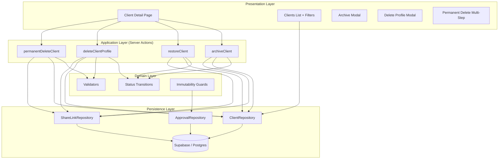
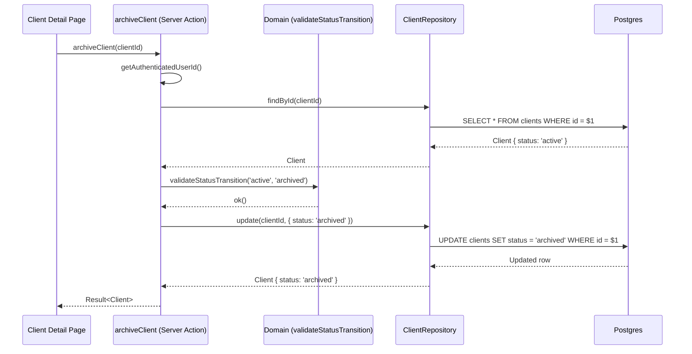
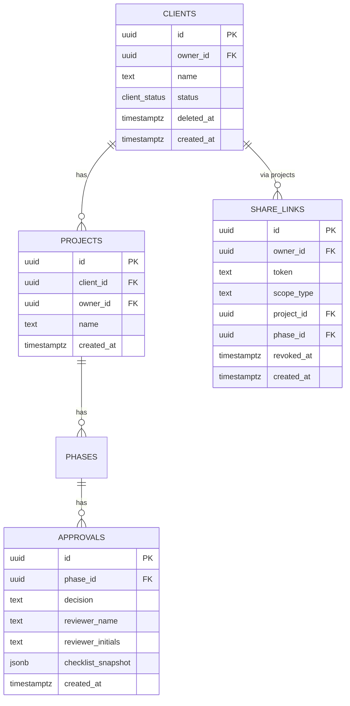
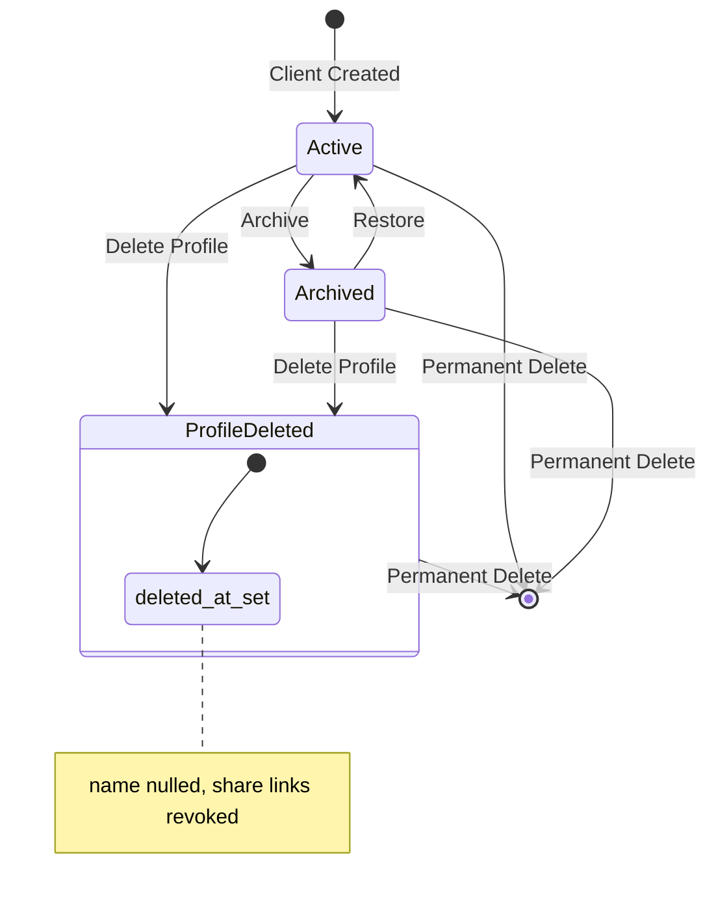

# Design Document: Client Data Retention

## Overview

This design introduces a tiered client lifecycle management system to the UX Client Sign-off Dashboard. The feature adds three distinct operations — Archive, Delete Profile, and Permanent Delete — each with increasing severity of data removal. The architecture preserves the existing layered pattern (Domain → Application → Persistence) while extending it with a `ClientStatus` type, status transition logic, and new server actions.

Key design decisions:
- **Status as a column, not a separate table** — Simplifies queries and avoids joins for the most common operation (filtering).
- **Soft-delete model for Archive/Delete Profile** — These operations modify state rather than removing rows, preserving referential integrity and audit trails.
- **Approval immutability enforced at both domain and database layers** — A Postgres trigger prevents UPDATE/DELETE on the approvals table, and domain-layer guards reject mutation attempts before they reach persistence.
- **Tiered confirmation UX** — Each action tier has progressively more friction to prevent accidental data loss.

## Architecture



### Data Flow: Archive Client



## Components and Interfaces

### Domain Layer

#### New Type: `ClientStatus`

```typescript
// src/lib/domain/types.ts (addition)
export type ClientStatus = 'active' | 'archived';

export interface Client {
  id: UUID;
  ownerId: UUID;
  name: string;
  status: ClientStatus;        // NEW
  deletedAt: ISOTimestamp | null; // NEW — set when profile is deleted
  createdAt: ISOTimestamp;
}
```

#### New Module: `src/lib/domain/client-lifecycle.ts`

```typescript
import type { Client, ClientStatus } from './types';
import { ok, err, appError, type Result, type AppError } from './result';

/** Valid state transitions for ClientStatus */
const VALID_TRANSITIONS: Record<ClientStatus, ClientStatus[]> = {
  active: ['archived'],
  archived: ['active'],
};

/**
 * Validate that a status transition is allowed.
 * Returns ok(targetStatus) if valid, err(AppError) if not.
 */
export function validateStatusTransition(
  current: ClientStatus,
  target: ClientStatus,
): Result<ClientStatus, AppError> {
  if (current === target) {
    return err(appError('invalid_state', `Client is already ${target}.`));
  }
  if (!VALID_TRANSITIONS[current]?.includes(target)) {
    return err(
      appError('invalid_state', `Cannot transition from ${current} to ${target}.`)
    );
  }
  return ok(target);
}

/**
 * Guard: ensure a client is eligible for profile deletion.
 * Client must exist and not already be profile-deleted.
 */
export function canDeleteProfile(client: Client): Result<void, AppError> {
  if (client.deletedAt !== null) {
    return err(appError('invalid_state', 'Client profile has already been deleted.'));
  }
  return ok(undefined);
}

/**
 * Guard: ensure share link creation is allowed for a client.
 * Archived or profile-deleted clients cannot have new share links.
 */
export function canCreateShareLink(client: Client): Result<void, AppError> {
  if (client.status === 'archived') {
    return err(appError('forbidden', 'Cannot create share links for archived clients.'));
  }
  if (client.deletedAt !== null) {
    return err(appError('forbidden', 'Cannot create share links for deleted client profiles.'));
  }
  return ok(undefined);
}

/**
 * Guard: reject any mutation attempt on an approval record.
 */
export function rejectApprovalMutation(): Result<never, AppError> {
  return err(
    appError('immutable', 'Approval records are immutable and cannot be modified or deleted.')
  );
}

/**
 * Validate permanent delete name confirmation.
 * The typed name must exactly match the client name (case-sensitive).
 */
export function validateDeleteConfirmation(
  clientName: string,
  typedName: string,
): Result<void, AppError> {
  if (typedName !== clientName) {
    return err(
      appError('invalid_state', 'Typed name does not match client name. Permanent delete cancelled.')
    );
  }
  return ok(undefined);
}
```

### Application Layer (Server Actions)

#### New Module: `src/lib/actions/client-lifecycle.ts`

Four new server actions:

| Action | Input | Effect | Returns |
|--------|-------|--------|---------|
| `archiveClient(id)` | Client UUID | Sets status → `'archived'` | `Result<Client, AppError>` |
| `restoreClient(id)` | Client UUID | Sets status → `'active'` | `Result<Client, AppError>` |
| `deleteClientProfile(id)` | Client UUID | Nulls name, sets `deletedAt`, revokes share links | `Result<void, AppError>` |
| `permanentDeleteClient(id, confirmation)` | Client UUID + typed name | Cascading hard delete of all data | `Result<void, AppError>` |

Each action:
1. Authenticates via `getAuthenticatedUserId()`
2. Loads the client via `repos.clients.findById(id)`
3. Runs domain-layer guards/validators
4. Executes the persistence operation
5. Returns a typed `Result`

### Repository Layer Extensions

#### `ClientRepository` additions

```typescript
// src/lib/repositories/interfaces.ts (ClientPatch extension)
export type ClientPatch = Partial<Pick<Client, 'name' | 'status' | 'deletedAt'>>;

// New method on ClientRepository
export interface ClientRepository {
  // ... existing methods ...

  /** List clients by owner, optionally filtered by status. */
  listByOwner(ownerId: UUID, filter?: { status?: ClientStatus }): Promise<Client[]>;

  /**
   * Perform a "delete profile" operation: null contact fields, set deletedAt.
   * Returns the updated client or null if not found.
   */
  deleteProfile(id: UUID): Promise<Client | null>;
}
```

#### `ShareLinkRepository` addition

```typescript
export interface ShareLinkRepository {
  // ... existing methods ...

  /** Revoke all active (non-revoked) share links for projects belonging to a client. */
  revokeByClient(clientId: UUID): Promise<number>;
}
```

## Data Models

### Database Migration: Add status column

```sql
-- Migration: add client status and deletedAt columns
-- Spec: client-data-retention

-- Add status enum type
create type public.client_status as enum ('active', 'archived');

-- Add status column with default 'active'
alter table public.clients
  add column status public.client_status not null default 'active';

-- Add deleted_at column (null means profile exists)
alter table public.clients
  add column deleted_at timestamptz default null;

-- Index for filtering by status (most common query pattern)
create index clients_owner_status on public.clients (owner_id, status);

-- Approval immutability trigger: prevent UPDATE or DELETE on approvals
create or replace function public.prevent_approval_mutation()
returns trigger as $$
begin
  raise exception 'Approval records are immutable and cannot be modified or deleted.';
  return null;
end;
$$ language plpgsql;

create trigger approvals_immutable
  before update or delete on public.approvals
  for each row
  execute function public.prevent_approval_mutation();
```

### Entity Relationship Changes



### Status Transition State Machine



## Correctness Properties

*A property is a characteristic or behavior that should hold true across all valid executions of a system — essentially, a formal statement about what the system should do. Properties serve as the bridge between human-readable specifications and machine-verifiable correctness guarantees.*

### Property 1: New clients default to active status

*For any* valid client creation input (name within 1–100 characters, valid owner ID), the resulting client record SHALL have `status` equal to `'active'` and `deletedAt` equal to `null`.

**Validates: Requirements 1.1, 1.2**

### Property 2: Client filter correctness

*For any* list of clients with mixed statuses and *for any* filter value (`'active'`, `'archived'`, or `'all'`), the filter function SHALL return exactly those clients whose status matches the filter (or all clients when filter is `'all'`), and no others.

**Validates: Requirements 2.2, 2.3, 2.4**

### Property 3: Archive–Restore round trip

*For any* client with status `'active'`, archiving then restoring SHALL produce a client with status `'active'` and all associated project history (projects, phases, approvals, comments, tasks) unchanged in count and content.

**Validates: Requirements 3.1, 3.5, 4.1, 4.5**

### Property 4: Archived clients block share link creation

*For any* client with status `'archived'`, attempting to create a share link for any of that client's projects SHALL be rejected with a forbidden error.

**Validates: Requirements 3.4**

### Property 5: Delete profile preserves project history

*For any* client with associated projects, phases, checklist items, comments, approvals, and activity logs, executing the delete-profile operation SHALL leave the count of all associated records unchanged, set the client's `deletedAt` to a non-null timestamp, and null the client's name field.

**Validates: Requirements 5.1, 5.3, 5.4, 5.5**

### Property 6: Delete profile revokes all share links

*For any* client with one or more active (non-revoked) share links, executing the delete-profile operation SHALL set `revokedAt` to a non-null timestamp on every share link associated with that client's projects.

**Validates: Requirements 5.2**

### Property 7: Approval record immutability

*For any* existing approval record and *for any* mutation payload (update fields or delete request), the system SHALL reject the operation and return an immutability error, leaving the record unchanged.

**Validates: Requirements 7.1, 7.3, 7.4**

### Property 8: Permanent delete name confirmation

*For any* client name and *for any* typed confirmation string, the permanent delete confirmation SHALL succeed if and only if the typed string is an exact (case-sensitive) match of the client name.

**Validates: Requirements 6.3**

### Property 9: Permanent delete cascades completely

*For any* client with associated data (projects, phases, checklist items, design links, comments, approvals, tasks, activity logs, share links), executing permanent delete SHALL result in zero remaining records associated with that client ID across all tables.

**Validates: Requirements 6.5**

### Property 10: Status transition validity

*For any* client and *for any* target status, the `validateStatusTransition` function SHALL return success only when the transition is in the set {active→archived, archived→active}, and SHALL return an error for all other combinations (including self-transitions).

**Validates: Requirements 3.1, 4.1**

## Error Handling

| Scenario | Error Type | Code | User-Facing Message |
|----------|-----------|------|---------------------|
| Unauthenticated request | `AppError` | `unauthorized` | "You must be signed in to perform this action." |
| Client not found | `AppError` | `not_found` | "Client not found." |
| Invalid state transition (e.g., archive already archived) | `AppError` | `invalid_state` | "Client is already archived." |
| Attempt to modify approval | `AppError` | `immutable` | "Approval records are immutable and cannot be modified or deleted." |
| Share link creation for archived client | `AppError` | `forbidden` | "Cannot create share links for archived clients." |
| Permanent delete name mismatch | `AppError` | `invalid_state` | "Typed name does not match client name. Permanent delete cancelled." |
| Profile already deleted | `AppError` | `invalid_state` | "Client profile has already been deleted." |
| Database/network failure | `AppError` | `internal` | "An unexpected error occurred. Please try again." |

### Error Propagation Strategy

1. **Domain layer** — Returns `Result<T, AppError>` for all guard violations. Never throws.
2. **Server actions** — Catches infrastructure errors and wraps them in `AppError` with code `'internal'`. Returns `Result` to the UI.
3. **UI layer** — Pattern-matches on error kind/code to display appropriate toast messages or inline errors.
4. **Database triggers** — The `approvals_immutable` trigger raises a Postgres exception which the Supabase client surfaces as an error. The repository layer catches this and maps it to an `AppError` with code `'immutable'`.

## Testing Strategy

### Property-Based Tests (fast-check)

The project already uses property-based testing extensively (via `fast-check`). Each correctness property above maps to a property-based test with a minimum of 100 iterations.

**Test file**: `src/lib/domain/client-lifecycle.property.test.ts`

| Property | Test Description | Tag |
|----------|-----------------|-----|
| 1 | Generate random valid names → create client → assert status='active' | Feature: client-data-retention, Property 1: New clients default to active status |
| 2 | Generate random client lists with mixed statuses → apply filter → assert correctness | Feature: client-data-retention, Property 2: Client filter correctness |
| 3 | Generate client + project history → archive → restore → assert unchanged | Feature: client-data-retention, Property 3: Archive–Restore round trip |
| 4 | Generate archived client → attempt share link → assert rejection | Feature: client-data-retention, Property 4: Archived clients block share link creation |
| 5 | Generate client with full history → delete profile → assert preservation | Feature: client-data-retention, Property 5: Delete profile preserves project history |
| 6 | Generate client with share links → delete profile → assert all revoked | Feature: client-data-retention, Property 6: Delete profile revokes all share links |
| 7 | Generate approval + random mutation → assert rejection | Feature: client-data-retention, Property 7: Approval record immutability |
| 8 | Generate random name pairs → assert match logic | Feature: client-data-retention, Property 8: Permanent delete name confirmation |
| 9 | Generate client with data → permanent delete → assert zero residual records | Feature: client-data-retention, Property 9: Permanent delete cascades completely |
| 10 | Generate all status pairs → validate transition → assert allowed set | Feature: client-data-retention, Property 10: Status transition validity |

### Unit Tests (Example-Based)

- Default filter selection on page load (Req 2.5)
- UI renders filter options (Req 2.1)
- Confirmation modal content for archive, delete profile (Req 5.6, 8.4, 8.5)
- Multi-step permanent delete flow (Req 6.2, 6.4, 8.6)
- Danger zone placement verification (Req 8.3)
- Authorization check for permanent delete (Req 6.1)

### Integration Tests

- Full archive → restore cycle against Supabase (verifies RLS + trigger behavior)
- Delete profile with real share link revocation
- Permanent delete cascade with real FK constraints
- Approval immutability trigger fires on UPDATE/DELETE attempt

### Test Configuration

- PBT library: `fast-check` (already in project dependencies)
- Minimum iterations: 100 per property
- Test runner: Vitest (existing project configuration)
- Each property test tagged with: `Feature: client-data-retention, Property {N}: {title}`
