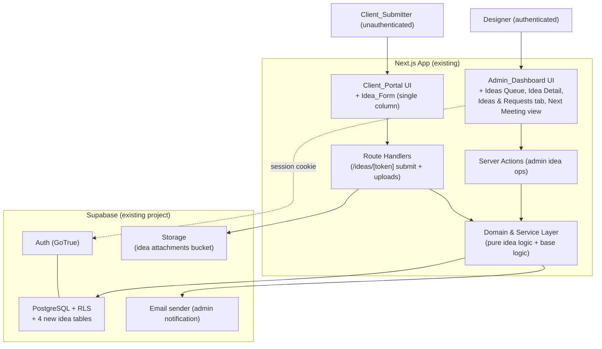
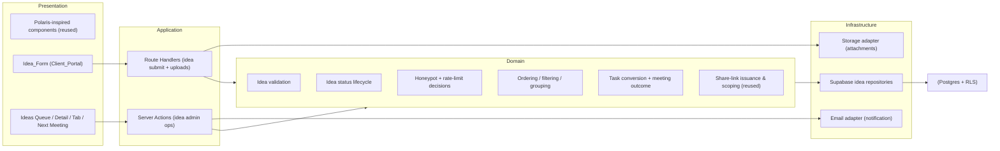
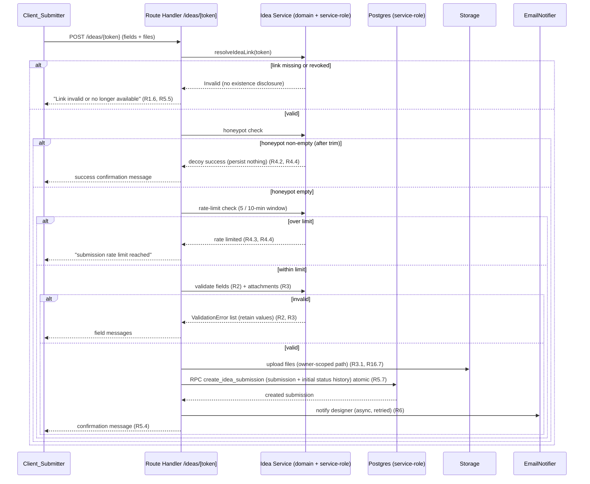
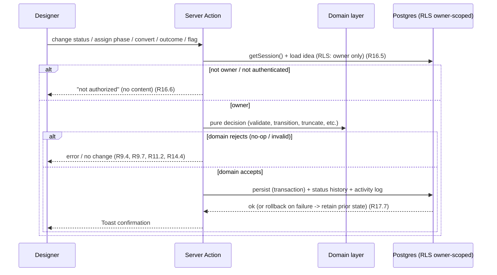
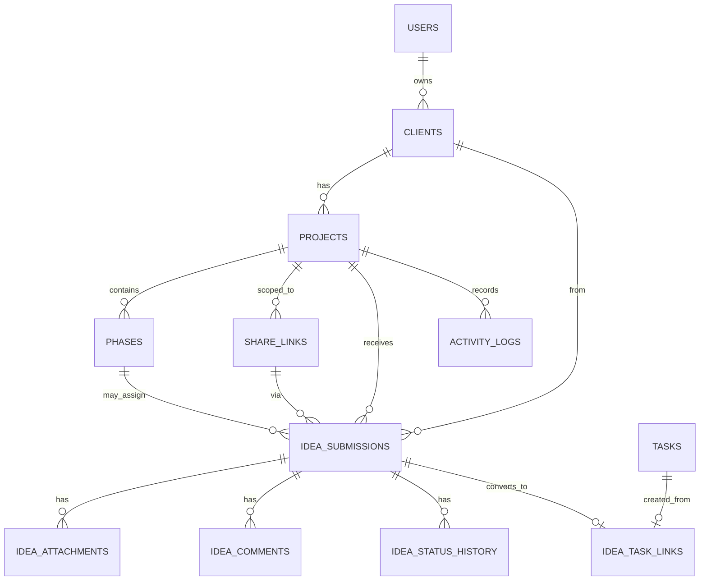

# Design Document

## Overview

The Client Ideas Queue extends the existing **Client Sign-Off Dashboard** (see `.kiro/specs/client-sign-off-dashboard/design.md`). It adds a low-friction way for clients to send ideas, feedback, inspiration links, screenshots, and change requests at any time — without signing in — and a single admin **Ideas Queue** where the **Designer** triages, comments, restatuses, assigns to phases, converts to tasks, and prepares meeting discussion lists.

This feature is a strict extension, not a parallel system. It reuses the base product's architecture and infrastructure verbatim wherever possible:

- **Same stack:** Next.js (App Router) + TypeScript (strict) + Tailwind CSS + Supabase (Postgres + Auth + Storage).
- **Same three-layer architecture:** a pure, Supabase-free **domain/service layer** (validation, enum/status logic, ordering/grouping/filtering, token generation, rate-limit and honeypot decisions, task-conversion truncation) that is directly property-testable; a **Supabase persistence layer** governed by Row Level Security; and a **Polaris-inspired presentation layer** shared with the base product.
- **Same actors:** the authenticated **Designer** and the unauthenticated **Client_Reviewer**. In this feature the Client_Reviewer acts as a **Client_Submitter** who reaches the **Idea_Form** through a private **Idea_Share_Link**.
- **Same infrastructure primitives, reused:** the existing `share_links` token mechanism (≥32-char random token, revocable) extended with an `idea` scope; the `StatusBadge` presentation-map pattern; the append-only `activity_logs` table for audit immutability; the `Result<T,E>` discipline; **Server Actions** for admin mutations and **Route Handlers** for uploads and the public portal path; and the existing entities `users`, `clients`, `projects`, `phases`, `tasks`, `activity_logs`, and `share_links`.
- **Same component library, reused:** `AppShell`/`Sidebar`, `PageHeader`, `Card`, `IndexTable`, `StatusBadge`, `EmptyState`, `Toast`, `Modal`, `Banner`, `Timeline`, `Filters`/`Tabs`, and the `Client_Portal` `ReviewLayout` single-column shell.

This document specifies the architecture, components, data models, correctness properties, error handling, security model, and testing strategy for the feature. It addresses all 17 requirements. References to requirements use the form `R{n}.{m}` (for example, `R4.3`).

### Design Goals and Key Decisions

| Decision | Rationale | Requirements |
|---|---|---|
| Reuse the base `share_links` table and token mechanism, adding a new `scope_type = 'idea'` (project-scoped) | The Idea_Share_Link is a Share_Link by definition; reusing the table inherits token generation, uniqueness, and revocation for free | R1.1, R1.6, R16.1, R16.2, R16.3 |
| Keep all idea business logic in the existing pure domain layer (no Supabase imports) | Validators, status lifecycle, ordering/filtering/grouping, honeypot/rate-limit decisions, and task-conversion truncation become deterministic and property-testable | R2–R5, R7–R14, R16 |
| Resolve the unauthenticated Idea_Form server-side with the existing service-role client, enforcing scope and read-only/create-only by construction | The Client_Submitter has no `auth.uid()`; scope and "view-form-or-create-only" must be enforced in code, exactly as the base portal path does | R1.1, R1.6, R16.1, R16.4 |
| Honeypot short-circuits **before** any persistence and returns the normal success confirmation (decoy) | Bots must not learn they were detected, and a honeypot hit must persist nothing — no submission, attachment, attempt record, or activity log | R4.1, R4.2, R4.4 |
| Per-link rate limit is a pure decision over recorded attempt timestamps (5 per rolling 10-minute window) | Keeps the rate-limit rule deterministic and testable; the persistence layer only supplies timestamps | R4.3, R4.4 |
| Persist the Idea_Submission and its initial Idea_Status_History entry in one transaction (Postgres RPC) | The two records must be all-or-nothing so status history can never drift from the submission | R5.7, R17.7 |
| Reuse the existing `tasks` entity for conversion; record the link in a dedicated `idea_task_links` join table with a unique constraint on `idea_submission_id` | Conversion must flow into the existing task list, and "Added to task list" must be idempotent (one task per idea) | R10.1–R10.5, R14.5, R14.6 |
| Reuse the append-only `activity_logs` table by adding idea event types; no UPDATE/DELETE grants | Idea submissions and status changes join the same immutable Audit_Trail as the base product | R15.1–R15.4 |
| Store attachments under an owner-scoped Storage path and gate retrieval on project ownership | The public surface uploads files, so attachment paths and retrieval must be bound to the owning Designer | R16.7, R16.8 |
| Compute the "New" visual distinction and Status_Badge from a single status-presentation map | One source of truth for the seven Idea_Status values keeps badges consistent across every view | R9.6, R13.2 |

## Architecture

### System Context

The feature plugs into the existing Next.js app and Supabase project. New surfaces are shaded; everything else is reused from the base product.



### Layered Architecture

The dependency rule from the base product is preserved: Presentation → Application → Domain → Infrastructure, with the Domain layer holding **no** Supabase imports. New idea logic is added to each layer without changing the direction of dependencies.



### Technology Stack (reused from base)

- **Framework:** Next.js App Router. Server Components render the data-heavy admin idea views; Client Components handle the Idea_Form, modals, toasts, and filters.
- **Language:** TypeScript (strict). Idea domain types live alongside the base domain types and are shared across server and client.
- **Styling:** Tailwind CSS with the existing Polaris-inspired design tokens. The Idea_Form reuses the `ReviewLayout` single-column shell.
- **Backend:** the existing Supabase project — Postgres (four new tables), Auth (Designer), Storage (a path/bucket for idea attachments).
- **Data access:** `@supabase/supabase-js` and `@supabase/ssr` for the Designer's session; the server-only **service-role client** (already used by the base portal path) resolves the Idea_Share_Link and performs the public submission insert.
- **Validation:** Zod at the boundary delegating to pure domain validators so the same rules run in tests.
- **Email:** the platform's transactional email sender, invoked through an `EmailNotifier` adapter with a bounded retry policy.
- **Property testing:** `fast-check` with Vitest (same as base).

### Rendering and Routing Strategy

- **Admin idea views** (`/ideas`, `/ideas/[id]`, the project `Ideas & Requests` tab at `/projects/[id]?tab=ideas`, and `/ideas/next-meeting`) are protected by the existing Next.js middleware that validates the Supabase session and redirects unauthenticated requests to `/sign-in`. All idea admin mutations are **Server Actions** that re-check the session and ownership.
- **The public Idea_Form** route (`/ideas/[token]`) is public at the routing layer, mirroring the base `/review/[token]` path. Authorization is performed server-side by resolving the Idea_Share_Link token, applying project scope, and permitting only form view + submission.
- **Submission and uploads** use **Route Handlers**: `POST /ideas/[token]` accepts the multipart form (fields + files), streams uploads with server-side size enforcement, and performs the atomic submission insert. This matches the base product's choice to use Route Handlers for multipart streaming and the unauthenticated write path.

### Idea Submission Flow (public)



### Idea Triage Flow (admin)



## Components and Interfaces

### Reused Component Library

No new general-purpose UI primitives are introduced. The feature composes existing components:

| Reused component | Use in this feature | Requirements |
|---|---|---|
| `ReviewLayout` (Client_Portal) | Single-column, sidebar-free shell for the Idea_Form; no horizontal overflow 320–1920px | R1.7, R1.10 |
| `AppShell` / `Sidebar` | Adds the "Ideas Queue" navigation entry | R7.1 |
| `PageHeader` | Titles for Ideas Queue, Idea detail, Next Meeting view | R7, R8, R14 |
| `IndexTable` | Ideas Queue list and Ideas & Requests tab rows | R7.2, R13.1 |
| `StatusBadge` | Renders the seven Idea_Status values via the idea status presentation map | R9.6, R13.2 |
| `EmptyState` | Empty Ideas Queue, empty detail sub-lists, no-filter-match, no flagged ideas | R7.4, R8.11, R13.8, R14.7 |
| `Toast` | Confirmation on status change, assignment, conversion, outcome | R9, R10, R11, R14 |
| `Modal` | Convert-to-task and revoke-link confirmations | R10, R16.3 |
| `Banner` | Invalid link, storage failure, persistence failure, rate-limit, load failure | R1.6, R3.5, R5.6, R7.8 |
| `Timeline` | Idea_Status_History display; idea entries in the activity timeline | R8, R9.5, R15 |
| `Filters` / `Tabs` | Project `Ideas & Requests` tab filtering | R13 |

### New Views

| View | Route | Responsibility | Requirements |
|---|---|---|---|
| Idea_Form | `/ideas/[token]` (public) | Single-column guided submission form within the Client_Portal | R1, R2, R3, R4, R5, R12.3, R12.4 |
| Ideas Queue | `/ideas` | Owner-scoped table of all Idea_Submissions, reverse-chron | R7 |
| Idea detail | `/ideas/[id]` | All fields, attachments, inspiration links, comments, status history, status/phase/convert/flag controls | R8, R9, R10, R11, R12 |
| Ideas & Requests tab | `/projects/[id]?tab=ideas` | Per-project idea list with type/status/priority/meeting-flag filters | R13 |
| Next Meeting view | `/ideas/next-meeting` | Flagged ideas grouped by Project and Client with Meeting_Outcome recording | R14 |

### Idea_Form Composition

The Idea_Form renders inside `ReviewLayout` (no admin sidebar, no admin navigation — R1.7) as a single vertical column (R1.10). It presents the heading "Share an idea or request" (R1.2), the read-only Project name derived from the link (R1.3, R1.4), and the controls in R1.8: Name, Email, idea title, details, Idea_Type selector, Idea_Priority selector, related-page URL, Inspiration_Link entry, image upload, document upload, and the "Should we discuss this in the next meeting?" flag. The submit control is labeled "Send to review" (R1.9). A visually hidden, non-focusable, empty honeypot field is included (R4.1).

### Application Layer: Server Actions and Route Handlers

Admin idea mutations are authenticated **Server Actions**; each loads the idea (RLS owner-scoped), calls a pure domain function, persists through a repository inside a transaction where multiple rows change, then records activity. Signatures (abbreviated, using the base `Result<T,E>`):

```ts
// Idea share links (reuses base generateShareLink/revokeShareLink with scope 'idea')
generateIdeaShareLink(projectId: string): Promise<Result<ShareLink, AppError>>   // R16.2
revokeIdeaShareLink(id: string): Promise<Result<void, AppError>>                 // R16.3

// Status lifecycle (R9)
changeIdeaStatus(ideaId: string, next: IdeaStatus): Promise<Result<IdeaSubmission, AppError>>

// Comments (R8.4–R8.6)
addIdeaComment(ideaId: string, text: string): Promise<Result<IdeaComment, ValidationError>>

// Phase assignment (R11)
assignIdeaPhase(ideaId: string, phaseId: string | null): Promise<Result<IdeaSubmission, AppError>>

// Convert to task (R10)
convertIdeaToTask(ideaId: string): Promise<Result<Task, AppError>>

// Next-meeting flag (R12.1, R12.2)
setIdeaMeetingFlag(ideaId: string, flag: boolean): Promise<Result<IdeaSubmission, AppError>>

// Meeting outcome (R14.3–R14.6)
recordMeetingOutcome(ideaId: string, outcome: MeetingOutcome): Promise<Result<IdeaSubmission, AppError>>

// Read models
getIdeasQueue(): Promise<Result<IdeaRow[], AppError>>                              // R7.2, R7.3, R7.8
getIdeaDetail(ideaId: string): Promise<Result<IdeaDetailViewModel, AppError>>      // R8
getProjectIdeas(projectId: string, filters: IdeaFilter): Promise<Result<IdeaRow[], AppError>> // R13
getNextMeeting(): Promise<Result<NextMeetingGroup[], AppError>>                    // R14.1
getIdeaAttachmentUrl(attachmentId: string): Promise<Result<string, AppError>>     // R8.2, R16.8
```

Unauthenticated public endpoints (Route Handlers using the server-only service-role client, scope and create-only enforced in code):

```ts
// GET  /ideas/[token]   -> resolveIdeaLink + read-only form view model (project name only) (R1.1, R1.3, R1.6)
// POST /ideas/[token]   -> honeypot -> rate-limit -> validate -> upload -> atomic create (R2–R5)
```

### Domain Layer (pure, testable)

All functions below are pure (no Supabase imports), operate on plain TypeScript types, and are injected with repository interfaces or supplied with already-loaded data. This is what makes the property tests practical.

```ts
// ---- Enums ----
type IdeaType = 'New idea' | 'Change request' | 'Website inspiration'
  | 'Content update' | 'Design feedback' | 'Question' | 'For next meeting';
type IdeaPriority = 'Low' | 'Medium' | 'High' | 'Not sure';
type IdeaStatus = 'New' | 'Reviewing' | 'Needs discussion' | 'Approved'
  | 'Not possible' | 'Added to scope' | 'Completed';
type MeetingOutcome = 'Discussed' | 'Approved' | 'Rejected'
  | 'Needs follow-up' | 'Added to task list';

// ---- Field validation (R2) ----
validateSubmitterName(raw: string): Result<string, ValidationError>;   // trim -> 1..100 (R2.2)
validateSubmitterEmail(raw: string): Result<string, ValidationError>;  // trim, <=254, single @, non-empty local+domain (R2.3)
validateIdeaTitle(raw: string): Result<string, ValidationError>;       // trim -> 1..200 (R2.4)
validateIdeaDetails(raw: string): Result<string, ValidationError>;     // trim -> 1..5000 (R2.5)
isIdeaType(v: string): v is IdeaType;                                  // (R2.6)
isIdeaPriority(v: string): v is IdeaPriority;                          // (R2.6)
validateOptionalUrl(raw: string): Result<string | null, ValidationError>; // empty->null, else http/https & <=2048 (R2.7)
validateInspirationLinks(raw: string[]): Result<string[], ValidationError[]>; // each http/https & <=2048, count<=10 (R2.8, R2.9)
validateIdeaSubmission(input: RawSubmission): Result<ValidSubmission, ValidationError[]>; // aggregate, reports ALL violations (R2.1, R2.10)

// ---- Attachment validation (R3) ----
const ALLOWED_MIME: readonly string[]; // png,jpeg,gif,webp,pdf,doc,docx,text/plain,csv,xls,xlsx
validateAttachment(meta: { fileName: string; mimeType: string; sizeBytes: number }):
  Result<AttachmentMeta, ValidationError>;   // allowed mime, 1..26214400 bytes, name<=255 (R3.1,3.2,3.3,3.6,3.7,3.8)
isWithinFileCount(n: number): boolean;       // n <= 10 (R3.4)

// ---- Spam protection (R4) ----
isHoneypotTriggered(raw: string): boolean;   // non-empty after trim (R4.1, R4.2)
isRateLimited(priorAttemptsUtc: ISOTimestamp[], now: Date,
  limit = 5, windowMs = 600_000): boolean;   // > limit within rolling window (R4.3)

// ---- Submission construction (R5, R12.3, R12.4) ----
buildIdeaSubmission(valid: ValidSubmission, link: ShareLink, now: Date):
  { submission: IdeaSubmission; initialHistory: IdeaStatusHistory }; // status New, created==updated, discuss flag from control

// ---- Idea share link resolution (reuses base token mechanism) ----
generateToken(rng: RandomSource): string;            // reused: >=32 chars, URL-safe (R16.2)
resolveIdeaLink(link: ShareLink | null): Result<IdeaLinkScope, InvalidLink>; // exists & not revoked (R1.1, R1.6, R5.5, R16.1, R16.3)
isIdeaLinkOperationAllowed(op: PortalOp, link: ShareLink | null): boolean;    // only view-form/create-in-scope (R16.4)

// ---- Status lifecycle (R9) ----
const IDEA_STATUS_PRESENTATION: Record<IdeaStatus, { label: string; colorToken: string }>; // (R9.6)
applyStatusChange(idea: IdeaSubmission, next: string, designer: UUID, now: Date):
  Result<{ idea: IdeaSubmission; history?: IdeaStatusHistory }, ValidationError>;
  // invalid -> reject; same -> no-op; different valid -> new status + updated ts + history (R9.2,9.3,9.4,9.7)

// ---- Comments (R8) ----
validateIdeaComment(raw: string): Result<string, ValidationError>;   // trim -> 1..5000 (R8.4, R8.5)

// ---- Convert to task (R10) ----
buildTaskFromIdea(idea: IdeaSubmission, now: Date): { task: Task; link: IdeaTaskLink };
  // open state, title = idea.title truncated to 200, project = idea.project, phase = idea.phaseId (R10.1,10.2,10.4)

// ---- Phase assignment (R11) ----
assignPhase(idea: IdeaSubmission, phaseId: string | null,
  projectPhaseIds: Set<string>, now: Date): Result<IdeaSubmission, ValidationError>; // phase must belong to project (R11.1,11.2,11.3)

// ---- Next-meeting flag (R12) ----
setMeetingFlag(idea: IdeaSubmission, flag: boolean, now: Date): IdeaSubmission; // persist + touch updated_at

// ---- Meeting outcome (R14) ----
isMeetingOutcome(v: string): v is MeetingOutcome;                              // (R14.4)
recordOutcome(idea: IdeaSubmission, outcome: string, now: Date): Result<IdeaSubmission, ValidationError>; // (R14.3,14.4)
shouldCreateTaskForOutcome(outcome: MeetingOutcome, hasExistingTask: boolean): boolean; // idempotent (R14.5,14.6)

// ---- Ordering / filtering / grouping ----
sortIdeasReverseChron(xs: IdeaSubmission[]): IdeaSubmission[]; // created_at desc, tie-break id desc (R7.3, R13.1)
sortIdeaComments(xs: IdeaComment[]): IdeaComment[];            // created_at asc (R8.7)
sortStatusHistory(xs: IdeaStatusHistory[]): IdeaStatusHistory[]; // ts desc (R9.5)
filterIdeas(xs: IdeaSubmission[], f: IdeaFilter): IdeaSubmission[]; // AND of applied filters (R13.3–R13.7, R13.9)
groupForNextMeeting(xs: IdeaSubmission[]): NextMeetingGroup[];  // flag set, grouped by project+client, reverse-chron (R14.1)
buildIdeaRow(idea: IdeaSubmission, attachmentCount: number): IdeaRow; // row fields incl count (R7.2)

// ---- Email content (R6.2) ----
buildNotificationEmail(idea: IdeaSubmission, project: Project): EmailContent; // fields + "not provided" indicators

// ---- Storage path (R16.7) ----
attachmentStoragePath(ownerId: UUID, ideaId: UUID, fileName: string): string; // owner-scoped prefix

// ---- Ownership authorization (R16.5, R16.6, R16.8, R7.7, R8.8) ----
canDesignerAccessIdea(designerId: UUID, idea: IdeaSubmission, ownedProjectIds: Set<string>): boolean;
```

## Data Models

### Entity-Relationship Overview

The four new tables (shaded conceptually) attach to existing base entities. `idea_submissions` references `projects`, `clients`, and the `share_links` row that produced it; it optionally references a `phases` row (assigned phase). `idea_task_links` joins an idea to a base `tasks` row.



### TypeScript Domain Types

```ts
type UUID = string;
type ISOTimestamp = string;  // UTC ISO-8601, second precision

interface IdeaSubmission {
  id: UUID;
  projectId: UUID;
  clientId: UUID;
  shareTokenId: UUID | null;       // the share_links row used; null after link deletion
  phaseId: UUID | null;            // assigned phase (R11)
  submittedByName: string;         // 1..100
  submittedByEmail: string;        // valid email, <=254
  title: string;                   // 1..200
  details: string;                 // 1..5000
  type: IdeaType;
  priority: IdeaPriority;
  relatedPageUrl: string | null;   // http/https, <=2048
  inspirationLinks: string[];      // each http/https <=2048, max 10
  discussNextMeeting: boolean;
  status: IdeaStatus;              // default 'New'
  meetingOutcome: MeetingOutcome | null;
  meetingOutcomeAt: ISOTimestamp | null;
  createdAt: ISOTimestamp;
  updatedAt: ISOTimestamp;
}

interface IdeaAttachment {
  id: UUID; ideaSubmissionId: UUID;
  storagePath: string;             // owner-scoped (R16.7)
  fileName: string;                // 1..255
  mimeType: string;                // allow-listed
  fileSizeBytes: number;           // 1..26214400
  createdAt: ISOTimestamp;
}

interface IdeaComment {
  id: UUID; ideaSubmissionId: UUID;
  authorUserId: UUID;              // the Designer
  text: string;                    // 1..5000
  createdAt: ISOTimestamp;         // UTC
}

interface IdeaStatusHistory {
  id: UUID; ideaSubmissionId: UUID;
  previousStatus: IdeaStatus | null; // null for the initial 'New' entry on creation
  newStatus: IdeaStatus;
  changedByUserId: UUID | null;      // null for the system-created initial entry
  createdAt: ISOTimestamp;           // UTC
}

interface IdeaTaskLink {
  ideaSubmissionId: UUID;          // unique -> at most one task per idea
  taskId: UUID;
  createdAt: ISOTimestamp;
}

interface IdeaFilter {
  type?: IdeaType;
  status?: IdeaStatus;
  priority?: IdeaPriority;
  meetingFlag?: boolean;
}

interface IdeaRow {
  id: UUID; submitterName: string; projectName: string;
  title: string; type: IdeaType; priority: IdeaPriority;
  status: IdeaStatus; submittedAt: ISOTimestamp; attachmentCount: number;
}
```

### Database Schema (PostgreSQL / Supabase)

The migration adds the `idea` scope to the existing `share_links` table, then creates four new tables plus the `idea_task_links` join table. Enum-valued columns use `check` constraints (R17.5, R17.9); foreign keys enforce parentage and cascade deletes (R17.3, R17.4, R17.6).

```sql
-- Extend the existing share_links scope to support idea submission links (R16.1, R16.2).
-- Idea links are project-scoped: project_id set, phase_id null.
alter table public.share_links
  drop constraint if exists share_links_scope_type_check;
alter table public.share_links
  add constraint share_links_scope_type_check
  check (scope_type in ('project','phase','idea'));
alter table public.share_links
  drop constraint if exists share_links_scope_shape_check;
alter table public.share_links
  add constraint share_links_scope_shape_check check (
       (scope_type = 'project' and project_id is not null and phase_id is null)
    or (scope_type = 'phase'   and phase_id   is not null)
    or (scope_type = 'idea'    and project_id is not null and phase_id is null)
  );

create table public.idea_submissions (
  id uuid primary key default gen_random_uuid(),
  project_id uuid not null references public.projects(id) on delete cascade,
  client_id  uuid not null references public.clients(id)  on delete cascade,
  share_token_id uuid references public.share_links(id) on delete set null,
  phase_id uuid references public.phases(id) on delete set null,
  submitted_by_name  text not null check (char_length(btrim(submitted_by_name)) between 1 and 100),
  submitted_by_email text not null check (char_length(btrim(submitted_by_email)) between 1 and 254),
  title   text not null check (char_length(btrim(title))   between 1 and 200),
  details text not null check (char_length(btrim(details)) between 1 and 5000),
  type text not null
    check (type in ('New idea','Change request','Website inspiration',
                    'Content update','Design feedback','Question','For next meeting')),
  priority text not null
    check (priority in ('Low','Medium','High','Not sure')),
  related_page_url text check (related_page_url is null or char_length(related_page_url) <= 2048),
  inspiration_links jsonb not null default '[]'::jsonb
    check (jsonb_typeof(inspiration_links) = 'array' and jsonb_array_length(inspiration_links) <= 10),
  discuss_next_meeting boolean not null default false,
  status text not null default 'New'
    check (status in ('New','Reviewing','Needs discussion','Approved',
                      'Not possible','Added to scope','Completed')),
  meeting_outcome text
    check (meeting_outcome is null or meeting_outcome in
      ('Discussed','Approved','Rejected','Needs follow-up','Added to task list')),
  meeting_outcome_at timestamptz,
  created_at timestamptz not null default now(),
  updated_at timestamptz not null default now()
);
create index on public.idea_submissions (project_id, created_at desc, id desc);
create index on public.idea_submissions (client_id);
create index on public.idea_submissions (status);
create index on public.idea_submissions (discuss_next_meeting) where discuss_next_meeting;

create table public.idea_attachments (
  id uuid primary key default gen_random_uuid(),
  idea_submission_id uuid not null references public.idea_submissions(id) on delete cascade,
  storage_path text not null,
  file_name text not null check (char_length(file_name) between 1 and 255),
  mime_type text not null check (mime_type in (
    'image/png','image/jpeg','image/gif','image/webp','application/pdf',
    'application/msword',
    'application/vnd.openxmlformats-officedocument.wordprocessingml.document',
    'text/plain','text/csv','application/vnd.ms-excel',
    'application/vnd.openxmlformats-officedocument.spreadsheetml.sheet')),
  file_size_bytes bigint not null check (file_size_bytes between 1 and 26214400),
  created_at timestamptz not null default now()
);
create index on public.idea_attachments (idea_submission_id);

create table public.idea_comments (
  id uuid primary key default gen_random_uuid(),
  idea_submission_id uuid not null references public.idea_submissions(id) on delete cascade,
  author_user_id uuid not null references public.users(id),
  text text not null check (char_length(btrim(text)) between 1 and 5000),
  created_at timestamptz not null default now()
);
create index on public.idea_comments (idea_submission_id, created_at);

create table public.idea_status_history (
  id uuid primary key default gen_random_uuid(),
  idea_submission_id uuid not null references public.idea_submissions(id) on delete cascade,
  previous_status text
    check (previous_status is null or previous_status in
      ('New','Reviewing','Needs discussion','Approved','Not possible','Added to scope','Completed')),
  new_status text not null
    check (new_status in
      ('New','Reviewing','Needs discussion','Approved','Not possible','Added to scope','Completed')),
  changed_by_user_id uuid references public.users(id),
  created_at timestamptz not null default now()
);
create index on public.idea_status_history (idea_submission_id, created_at desc);

create table public.idea_task_links (
  idea_submission_id uuid not null unique references public.idea_submissions(id) on delete cascade,
  task_id uuid not null references public.tasks(id) on delete cascade,
  created_at timestamptz not null default now(),
  primary key (idea_submission_id, task_id)
);
```

The base `activity_logs.type` check constraint is extended to include the two idea event types so submissions and status changes join the existing immutable Audit_Trail (R15.1, R15.2):

```sql
alter table public.activity_logs drop constraint if exists activity_logs_type_check;
alter table public.activity_logs add constraint activity_logs_type_check
  check (type in ('comment_created','approval_created','phase_status_changed',
                  'idea_submitted','idea_status_changed'));
```

### Atomic Submission Creation (R5.7, R17.7)

A Postgres function `create_idea_submission(...)` inserts the `idea_submissions` row and its initial `idea_status_history` row (`previous_status` null, `new_status` 'New', `changed_by_user_id` null) inside one transaction. Attachment rows are inserted in the same transaction after their files are confirmed in Storage. If any statement fails, the transaction rolls back so neither the submission nor any child row persists (R5.6, R5.7, R17.7).

### Cascade-Delete Behavior (R17.6, R17.10)

Deleting an `idea_submissions` row cascades to its `idea_attachments`, `idea_comments`, `idea_status_history`, and `idea_task_links` rows via `on delete cascade`. The underlying Storage objects are removed by the application as a post-transaction step (Postgres cannot reach object storage); if one or more files cannot be removed, the application returns an error identifying that stored files could not be removed (R17.10). Deleting a Client or Project still cascades through `projects → idea_submissions → {attachments, comments, status_history, task_links}`, so existing client/project deletion remains all-or-nothing.

### Idea Status Presentation Map (R9.6, R13.2)

A single constant maps each of the seven Idea_Status values to one fixed label and one fixed, visually distinct color token. Every view renders idea badges through this map, and the "New" visual distinction on the Ideas & Requests tab (R13.2) derives from the same source.

| Status value | Label | Color token |
|---|---|---|
| `New` | New | blue |
| `Reviewing` | Reviewing | indigo |
| `Needs discussion` | Needs discussion | amber |
| `Approved` | Approved | green |
| `Not possible` | Not possible | red |
| `Added to scope` | Added to scope | teal |
| `Completed` | Completed | grey |

### Row Level Security (RLS) Policies

RLS is enabled on all four new tables, following the base product's "owner-via-parent" pattern. The Designer is authorized through project ownership; the unauthenticated public path uses the server-only service-role client (which bypasses RLS) with scope and create-only enforcement performed in code, exactly as the base portal path does.

```sql
alter table public.idea_submissions enable row level security;
create policy idea_submissions_owner on public.idea_submissions
  using (exists (select 1 from public.projects p
                 where p.id = idea_submissions.project_id and p.owner_id = auth.uid()))
  with check (exists (select 1 from public.projects p
                      where p.id = idea_submissions.project_id and p.owner_id = auth.uid()));

-- Child tables authorize via the parent idea's project owner.
alter table public.idea_attachments enable row level security;
create policy idea_attachments_owner on public.idea_attachments
  using (exists (select 1 from public.idea_submissions s
                 join public.projects p on p.id = s.project_id
                 where s.id = idea_attachments.idea_submission_id and p.owner_id = auth.uid()))
  with check (exists (select 1 from public.idea_submissions s
                 join public.projects p on p.id = s.project_id
                 where s.id = idea_attachments.idea_submission_id and p.owner_id = auth.uid()));

-- Analogous owner-via-parent policies for idea_comments, idea_status_history, idea_task_links.
```

The Supabase Storage bucket for idea attachments is private; files are written under an owner-scoped prefix (e.g., `ideas/{ownerId}/{ideaId}/{fileName}`) and retrieved only by the owning Designer through short-lived signed URLs minted server-side after the ownership check (R16.7, R16.8). `activity_logs` remains append-only (no UPDATE/DELETE grants), so idea activity entries are immutable (R15.4).

## Correctness Properties

*A property is a characteristic or behavior that should hold true across all valid executions of a system — essentially, a formal statement about what the system should do. Properties serve as the bridge between human-readable specifications and machine-verifiable correctness guarantees.*

These properties target the pure domain layer (idea field/attachment validation, spam decisions, submission construction, the status lifecycle, ordering/filtering/grouping, task conversion, phase assignment, meeting outcomes, share-link resolution, activity-entry construction, and ownership/path logic). Each is universally quantified and is implemented as a single property-based test running at least 100 iterations. UI rendering, layout/responsiveness, timing budgets, email delivery, DB FK/cascade/transaction behavior, Storage I/O, and middleware/RLS enforcement are validated by example, integration, snapshot, and smoke tests instead (see Testing Strategy). The reflection consolidated overlapping criteria into the comprehensive properties below.

### Property 1: Submitter name validation

*For any* string, `validateSubmitterName` accepts it if and only if its length after trimming is 1 to 100, returning the trimmed value; on rejection no submission is constructed and the entered values are retained.

**Validates: Requirements 2.2**

### Property 2: Submitter email validation

*For any* string, `validateSubmitterEmail` accepts it if and only if, after trimming, it is non-empty, at most 254 characters, and contains exactly one `@` character separating a non-empty local part from a non-empty domain part.

**Validates: Requirements 2.3**

### Property 3: Idea title validation

*For any* string, `validateIdeaTitle` accepts it if and only if its trimmed length is 1 to 200, returning the trimmed value.

**Validates: Requirements 2.4**

### Property 4: Idea details validation

*For any* string, `validateIdeaDetails` accepts it if and only if its trimmed length is 1 to 5000, returning the trimmed value.

**Validates: Requirements 2.5**

### Property 5: Type and priority membership

*For any* string, `isIdeaType` is true if and only if the string is one of the seven defined Idea_Type values, and `isIdeaPriority` is true if and only if the string is one of the four defined Idea_Priority values.

**Validates: Requirements 2.6**

### Property 6: Optional related-page URL validation

*For any* string, `validateOptionalUrl` accepts an empty-after-trim value as absent (null), and otherwise accepts if and only if the value uses the http or https scheme and does not exceed 2048 characters.

**Validates: Requirements 2.7**

### Property 7: Inspiration links validation

*For any* array of strings, `validateInspirationLinks` accepts it if and only if the array contains at most 10 elements and every element uses the http or https scheme and does not exceed 2048 characters; on rejection it identifies each invalid element and, when the count exceeds 10, the count violation.

**Validates: Requirements 2.8, 2.9**

### Property 8: Aggregate validation reports every violation

*For any* raw submission, `validateIdeaSubmission` accepts it if and only if every field satisfies its individual rule, and when it rejects, the set of reported field violations equals exactly the set of fields that fail their individual rules; rejection mutates no persisted state.

**Validates: Requirements 2.1, 2.10**

### Property 9: Attachment validation and metadata preservation

*For any* file metadata (file name, MIME type, size in bytes), `validateAttachment` accepts it if and only if the MIME type is in the allowed set, the size is between 1 and 26,214,400 bytes inclusive, and the file name length is 1 to 255; an accepted result preserves the original file name, MIME type, and size, and a rejected file produces no attachment.

**Validates: Requirements 3.1, 3.2, 3.3, 3.6, 3.7, 3.8**

### Property 10: File-count limit

*For any* count of files attached to one submission, `isWithinFileCount` is true if and only if the count is at most 10; exceeding it rejects the submission and retains entered values.

**Validates: Requirements 3.4**

### Property 11: Honeypot decision

*For any* string, `isHoneypotTriggered` is true if and only if the value is non-empty after trimming leading and trailing whitespace.

**Validates: Requirements 4.1, 4.2**

### Property 12: Rate-limit decision over a rolling window

*For any* list of prior attempt timestamps and any current time, `isRateLimited` is true if and only if the number of attempts falling within the trailing 10-minute window ending at the current time is at least the limit of 5.

**Validates: Requirements 4.3**

### Property 13: Rejection paths produce no side effects

*For any* submission input that triggers the honeypot or the rate limit, the resulting effect set is empty — no Idea_Submission, no Idea_Attachment, and no Activity_Log entry is produced — and a honeypot-triggered input additionally yields the standard success confirmation outcome.

**Validates: Requirements 4.2, 4.4**

### Property 14: Submission construction invariants

*For any* valid submission input and any resolved Idea_Share_Link, `buildIdeaSubmission` produces a submission whose project and client equal the link's project and client, whose stored fields (name, email, title, details, type, priority, related-page URL, inspiration links, and the discuss-next-meeting flag taken from the form control) equal the validated input, whose status is `New`, and whose created and updated timestamps are equal; it also emits an initial Idea_Status_History entry with new status `New`, null previous status, and a matching timestamp.

**Validates: Requirements 1.5, 5.1, 5.2, 5.3, 9.1, 12.3, 12.4**

### Property 15: Idea share-link resolution and indistinguishability

*For any* share link in any state, `resolveIdeaLink` resolves to an accessible idea scope if and only if the link exists and its `revokedAt` is null; for any nonexistent token and any revoked token the rejection result is identical, disclosing nothing about whether an associated project exists, and a submission attempted through such a link creates no Idea_Submission.

**Validates: Requirements 1.6, 5.5, 16.1, 16.3**

### Property 16: Portal operation is view-or-create-only

*For any* requested portal operation and any link state, `isIdeaLinkOperationAllowed` is true if and only if the operation is viewing the Idea_Form or creating an Idea_Submission for the in-scope Project through a valid (existing, non-revoked) link; every other operation is rejected with no state change and no existence disclosure.

**Validates: Requirements 16.4**

### Property 17: Status presentation map totality and distinctness

*For all* seven Idea_Status values, `IDEA_STATUS_PRESENTATION` returns exactly one label and one color token, the mapping is deterministic, and the assigned color tokens are pairwise distinct across the seven statuses.

**Validates: Requirements 9.6, 13.2**

### Property 18: Status change transition, no-op, and rejection

*For any* Idea_Submission and any candidate status value, `applyStatusChange` behaves as follows: if the candidate is a defined status different from the current status, it sets the new status, sets the updated timestamp to the change time, and emits an Idea_Status_History entry recording the previous status, the new status, the changing Designer, and the timestamp; if the candidate equals the current status, it makes no change, emits no history, and leaves the updated timestamp unchanged; if the candidate is not a defined status value, it rejects the change, retains the current status, emits no history, and leaves the updated timestamp unchanged.

**Validates: Requirements 9.2, 9.3, 9.4, 9.7, 17.9**

### Property 19: Idea comment validation and attribution

*For any* string, `validateIdeaComment` accepts it if and only if its trimmed length is 1 to 5000; an accepted comment is attributed to the submitting Designer with a UTC creation timestamp, and a rejected comment creates nothing while retaining the entered text.

**Validates: Requirements 8.4, 8.5**

### Property 20: Task construction from an idea

*For any* Idea_Submission, `buildTaskFromIdea` produces a task in the open state whose title equals the idea's title truncated to its first 200 characters (and equal to the full title when it is at most 200 characters), whose project equals the idea's project, and whose phase equals the idea's assigned phase (or none when unassigned); it also emits an association pairing the created task with the source idea.

**Validates: Requirements 10.1, 10.2, 10.3, 10.4**

### Property 21: Phase assignment validity

*For any* Idea_Submission, candidate phase, and the set of phase identifiers belonging to the idea's project, `assignPhase` sets and replaces the assigned phase and bumps the updated timestamp when the candidate phase belongs to that project; clears the assignment and bumps the updated timestamp when the candidate is none; and rejects the change while retaining the prior phase assignment when the candidate phase does not belong to the project.

**Validates: Requirements 11.1, 11.2, 11.3**

### Property 22: Meeting-flag set and clear

*For any* Idea_Submission and boolean target, `setMeetingFlag` persists the discuss-next-meeting flag equal to the target and sets the updated timestamp to the change time.

**Validates: Requirements 12.1, 12.2**

### Property 23: Meeting-outcome recording and validity

*For any* Idea_Submission and candidate outcome value, `recordOutcome` persists the outcome, sets the meeting-outcome timestamp, and bumps the updated timestamp if and only if the candidate is one of the five defined Meeting_Outcome values; a candidate outside that set is rejected and the current outcome is retained.

**Validates: Requirements 14.3, 14.4**

### Property 24: Idempotent task creation for "Added to task list"

*For any* outcome value and any existing-task flag, `shouldCreateTaskForOutcome` is true if and only if the outcome is `Added to task list` and no task already exists for the idea, so recording that outcome creates exactly one task when none exists and no additional task when one already exists.

**Validates: Requirements 14.5, 14.6**

### Property 25: Reverse-chronological idea ordering with deterministic tie-break

*For any* list of Idea_Submissions, `sortIdeasReverseChron` orders the list by creation timestamp descending, breaking ties by descending Idea_Submission identifier, and the result is a permutation of the input.

**Validates: Requirements 7.3, 13.1**

### Property 26: Idea row projection completeness

*For any* Idea_Submission and any attachment count, `buildIdeaRow` produces a row containing the submitter name, project name, title, type, priority, status, submitted date, and an attachment count equal to the supplied count.

**Validates: Requirements 7.2**

### Property 27: Comment display ordering

*For any* set of Idea_Comments for an Idea_Submission, `sortIdeaComments` orders them non-decreasing by creation timestamp (oldest to newest).

**Validates: Requirements 8.7**

### Property 28: Status-history display ordering

*For any* set of Idea_Status_History entries, `sortStatusHistory` orders them non-increasing by timestamp (most recent first).

**Validates: Requirements 9.5**

### Property 29: Filter conjunction exactness

*For any* list of Idea_Submissions and any combination of applied filters (type, status, priority, meeting flag), `filterIdeas` returns all and only the submissions that satisfy every applied filter; when no filters are applied it returns all input submissions.

**Validates: Requirements 13.3, 13.4, 13.5, 13.6, 13.7, 13.9**

### Property 30: Next-meeting grouping

*For any* list of Idea_Submissions, `groupForNextMeeting` includes exactly the submissions whose discuss-next-meeting flag is set, partitions them by associated Project and Client, and orders the submissions within each group in reverse chronological order by creation timestamp.

**Validates: Requirements 14.1**

### Property 31: Activity-entry construction

*For any* idea creation, `buildActivityEntry` produces an entry of type `idea_submitted` carrying the submitter name, the idea title, and a UTC timestamp; for any status change it produces an entry of type `idea_status_changed` carrying the idea title, the changing Designer, the previous status, the new status, and a UTC timestamp.

**Validates: Requirements 15.1, 15.2**

### Property 32: Idea audit immutability

*For any* attempt to modify or delete an idea-related Activity_Log entry, the attempt is rejected, the original entry is preserved unchanged, and an immutability indication is returned.

**Validates: Requirements 15.4**

### Property 33: Ownership authorization

*For any* Designer, Idea_Submission, and the set of project identifiers owned by that Designer, `canDesignerAccessIdea` is true if and only if the idea's project belongs to the owned set; a non-owner is denied access to viewing, commenting, status change, phase assignment, task conversion, meeting-outcome recording, and attachment retrieval.

**Validates: Requirements 8.8, 16.5**

### Property 34: Token generation

*For any* sequence of token generations, every produced token has length at least 32, uses only URL-safe characters, and all tokens in the sequence are pairwise distinct.

**Validates: Requirements 16.2**

### Property 35: Owner-scoped attachment path

*For any* owner identifier, idea identifier, and file name, `attachmentStoragePath` returns a path prefixed by the owner's scope segment so that every stored attachment lives under a path bound to the owning Designer.

**Validates: Requirements 16.7**

### Property 36: Notification email content

*For any* Idea_Submission and its Project, `buildNotificationEmail` produces content that includes the project name, the submitter name, the idea title, the Idea_Type, and the Idea_Priority, substituting an explicit not-provided indicator for any of those values that is empty.

**Validates: Requirements 6.2**

### Property 37: Accepted mutations bump the updated timestamp

*For any* Idea_Submission and any accepted state-changing domain operation (`applyStatusChange` to a different valid status, `assignPhase`, `setMeetingFlag`, `recordOutcome`), the returned submission's updated timestamp equals the operation's supplied current time and is greater than or equal to the prior updated timestamp.

**Validates: Requirements 17.8**

## Error Handling

The feature uses the base product's uniform `Result<T, E>` discipline in the domain and application layers; exceptions are reserved for genuinely exceptional infrastructure faults. Errors are surfaced through the reused Polaris-inspired patterns: inline field messages on the Idea_Form, `Banner` for page-level failures, and `Toast` for admin confirmations.

### Error Categories

| Category | Examples | Surface | Requirements |
|---|---|---|---|
| Field validation | Name/email/title/details out of range; bad related-page URL; invalid/over-count inspiration links; multiple violations | Inline field messages identifying every violating field; entered values retained | R2.2–R2.10 |
| Attachment validation | Disallowed MIME type; >25 MB; 0 bytes; name >255; >10 files | Inline upload error identifying the cause; no attachment created; submission rejected for the count case | R3.2, R3.3, R3.4, R3.7, R3.8 |
| Spam rejection | Honeypot non-empty (decoy success); per-link rate limit exceeded | Honeypot returns standard success message; rate limit returns "submission rate limit reached"; nothing persisted | R4.2, R4.3, R4.4 |
| Invalid/revoked link | Nonexistent or revoked Idea_Share_Link on view or submit | Generic "link invalid or no longer available" `Banner`; no existence disclosure | R1.6, R5.5, R16.3 |
| Storage failure | Attachment upload write fails; attachment retrieval/open fails | `Banner` with explicit cause; no attachment row; submission rolled back; detail view retained on open failure | R3.5, R5.6, R8.10, R17.10 |
| Persistence failure | Submission, comment, status change, phase assignment, flag, or outcome write fails | `Banner`/`Toast` describing the failed operation; no partial commit; prior state retained | R5.6, R8.6, R9.8, R11.4, R12.5, R17.7 |
| Authorization | Non-owner or unauthenticated access to any admin idea operation | Generic "not authorized"/"authentication required"; no content; no state change | R7.7, R8.8, R16.6 |
| Notification failure | Email send fails after retries; owner has no email of record | Submission retained unchanged; failure logged with idea id and reason | R6.4, R6.5 |
| Activity-log failure | Activity entry write fails | Idea and its status retained unchanged; logging failure recorded in system log | R15.5 |

### Transactional Integrity (R5.7, R17.7)

The submission insert and its initial status-history insert run inside one Postgres function/RPC, with attachment-row inserts in the same transaction after Storage confirms each file. Any failed statement rolls back the whole transaction so no partial Idea_Submission, attachment, or history row persists, and the Client_Submitter's entered values are retained for resubmission (R5.6). Admin multi-row mutations (status change + history + activity log; convert + association; outcome + task creation) likewise run in a single transaction so they are all-or-nothing.

### Upload Failure Handling (R3.5, R5.6, R8.10, R17.10)

Files are size-checked from reported size before transfer and enforced server-side during streaming in the Route Handler, which aborts once the 25 MB threshold is crossed. An `idea_attachments` row is created only after the Storage write confirms success; if Storage fails, no row is written and the enclosing submission transaction rolls back (R3.5, R5.6). On attachment open, retrieval failure surfaces an error and keeps the detail view displayed (R8.10). On idea deletion, Storage objects are removed after the DB transaction commits; if one or more files cannot be removed, the operation returns an error identifying that stored files could not be removed (R17.10).

### Notification Failure Handling (R6.3–R6.5)

The `EmailNotifier` adapter sends one notification per new submission. On failure it retries up to 3 additional times with all attempts bounded to within 5 minutes of creation. If all attempts fail, the submission is retained unchanged and the failure (idea id + reason) is written to the system log. If the owning Designer has no valid email of record, no send is attempted, the submission is retained, and the failure (idea id) is logged.

### Invalid-Link Handling (R1.6, R5.5, R16.3, R16.4)

Nonexistent and revoked tokens produce a byte-identical generic response with no signal about whether an underlying project exists (Property 15). View or write operations attempted through such links, and any operation other than view-form or create-in-scope, are rejected with no state change (Property 16).

## Security Considerations

| Concern | Control | Requirements |
|---|---|---|
| Public surface scope | Idea_Form reachable only through a valid `idea`-scoped Share_Link; resolution and scope enforced server-side with the service-role client; only view-form and create-in-scope are permitted | R1.1, R16.1, R16.4 |
| No admin exposure to clients | Idea_Form renders in `ReviewLayout` with no admin sidebar and no navigation to any Admin_Dashboard view | R1.7 |
| Designer data isolation | RLS owner-via-parent policies on all four new tables; admin Server Actions re-check session and ownership; `canDesignerAccessIdea` as a second gate | R8.8, R16.5, R16.6 |
| Token unpredictability | Reuses the base cryptographically secure RNG producing ≥32-char URL-safe tokens; uniqueness enforced by the existing `share_links` unique constraint | R16.2 |
| Revocation | Revoked links resolve as inaccessible immediately on the next request via `revoked_at` check | R16.3 |
| Information disclosure | Invalid/revoked links and out-of-scope operations return an indistinguishable generic response | R1.6, R16.4 |
| Attachment isolation | Private Storage bucket; files written under an owner-scoped prefix; retrieval only via short-lived signed URLs minted after the ownership check | R16.7, R16.8 |
| Spam resistance | Hidden, non-focusable honeypot field; per-link rate limit of 5 submissions per rolling 10-minute window; honeypot hits persist nothing while returning the decoy success message | R4.1, R4.2, R4.3, R4.4 |
| Upload abuse | Allow-listed MIME types; 25 MB server-enforced per-file cap; 10-file cap; 0-byte and over-length filenames rejected | R3.1–R3.4, R3.7, R3.8 |
| Audit integrity | Idea events append to the existing `activity_logs` table, which grants no UPDATE/DELETE, making idea audit entries immutable | R15.3, R15.4 |
| Input safety | Zod + domain validation at every boundary; http/https scheme allow-list for URLs; React output escaping; parameterized queries via Supabase client | R2.7, R2.8, R3 |

The Idea_Form is intentionally unauthenticated; its security rests on token secrecy plus server-side scope, create-only enforcement, and spam controls. As with the base Client_Portal, no endpoint reachable by a Client_Submitter can read or mutate anything beyond creating an in-scope Idea_Submission for the linked Project — it cannot reach the Admin_Dashboard, other clients' data, or any other Project.

## Testing Strategy

The feature's core is a set of pure functions and deterministic transformations (validators, spam decisions, submission/task/activity construction, the status lifecycle, ordering/filtering/grouping, meeting-outcome logic, share-link resolution, ownership and path logic). Property-based testing applies to that domain layer. Infrastructure concerns (FK enforcement, cascade delete, transactional atomicity, Supabase Auth/RLS, Storage, email delivery and retries), UI rendering, and responsive layout are not property-based and use the complementary strategies below.

### Dual Testing Approach

- **Property tests** verify the universal properties above across many generated inputs.
- **Unit/example tests** verify specific behaviors, exact UI strings, attribution, and error messaging.
- **Component tests** verify rendering, empty states, the honeypot's hidden/non-focusable state, modals, toasts, and the Idea_Form composition.
- **Integration tests** verify FK constraints, cascade delete, transactional atomicity, RLS enforcement, Storage wiring (owner-scoped paths, signed URLs), and email delivery/retry with 1–3 representative cases each.
- **Smoke tests** verify schema presence and one-time configuration.
- **Visual/responsive tests** verify no horizontal overflow from 320px to 1920px on the Idea_Form.

### Property-Based Testing Requirements

- Library: **fast-check** with **Vitest** (same as the base product).
- Do not implement property-based testing from scratch; use the library's generators and runners.
- Each correctness property (1–37) is implemented as a **single** property-based test.
- Each property test runs a **minimum of 100 iterations** (`fc.assert(..., { numRuns: 100 })` or higher).
- Each property test is tagged with a comment referencing its design property in the format:
  `// Feature: client-ideas-queue, Property {number}: {property_text}`
- Generators must exercise edge inputs: empty and all-whitespace strings; boundary lengths (0, 1, 100, 101, 200, 201, 254, 255, 256, 2048, 2049, 5000, 5001); boundary byte sizes (0, 1, 26214400, 26214401); near-boundary inspiration-link counts (0, 10, 11) and file counts (0, 10, 11); valid/invalid email shapes (no `@`, multiple `@`, empty local/domain); http/https vs other schemes; Unicode in names/titles; rolling-window timestamps straddling the 10-minute edge; equal creation timestamps for tie-break ordering; revoked vs nonexistent links; empty and large collections; and all enum members plus out-of-set values for type, priority, status, and meeting outcome.

### Example, Integration, and Smoke Coverage (non-PBT criteria)

| Strategy | Criteria covered |
|---|---|
| Example/unit/component | R1.2, R1.3, R1.4, R1.7, R1.8, R1.9, R4.1, R5.4, R6.5, R7.1, R7.4, R7.5, R8.1, R8.3, R8.9, R8.11, R13.2, R13.8, R14.2, R14.7 |
| Integration | R1.1, R3.5, R5.6, R5.7, R6.1, R6.3, R6.4, R7.6, R7.7, R7.8, R8.2, R8.6, R8.10, R9.8, R10.5, R11.4, R12.5, R15.5, R16.6, R16.8, R17.3, R17.4, R17.5, R17.6, R17.7, R17.10 |
| Smoke | R1.10, R15.3, R17.1, R17.2 |

### Test Data and Isolation

- Domain property/unit tests run fully in-memory against repository fakes — no Supabase dependency — enabling fast 100+ iteration runs.
- Integration tests run against a local Supabase instance with the idea migration applied, seeded per test, then rolled back or truncated to isolate cases.
- Storage, Auth/RLS, and email integration tests use a dedicated test bucket, test accounts, and an email stub; they assert wiring and retry behavior with a small number of representative cases rather than exhaustive iteration.

### Traceability

Every requirement is covered by at least one test: testable-as-property criteria map to Properties 1–37; the remaining criteria map to the example/integration/smoke/component tests enumerated above. Property tags link each test back to its design property, and each property lists the requirements it validates, closing the loop from requirement → property → test. Where this feature reuses base-product infrastructure (the `share_links` token mechanism, append-only `activity_logs`, the `tasks` entity, the Polaris-inspired component library, and the service-role portal path), the corresponding base tests continue to apply and the new tests focus on idea-specific behavior.
