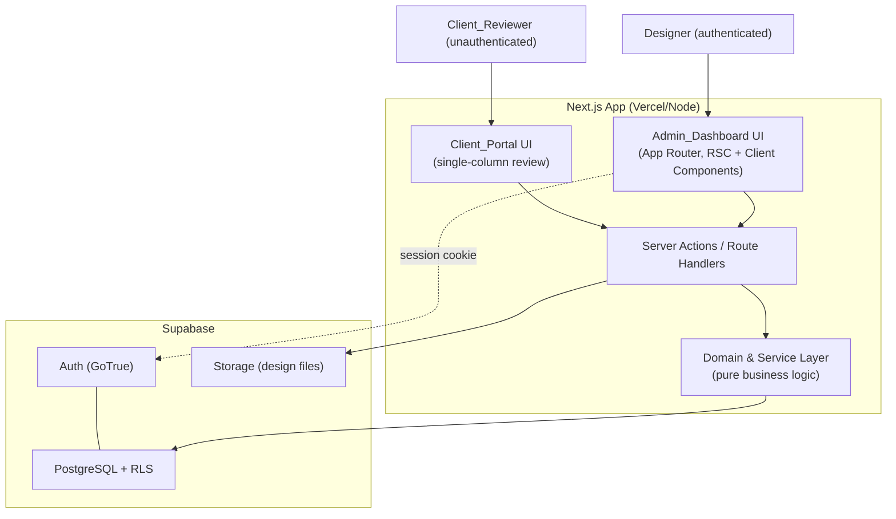
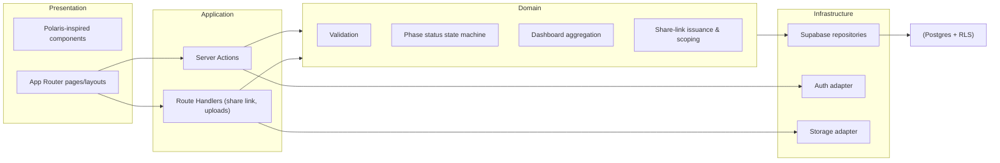
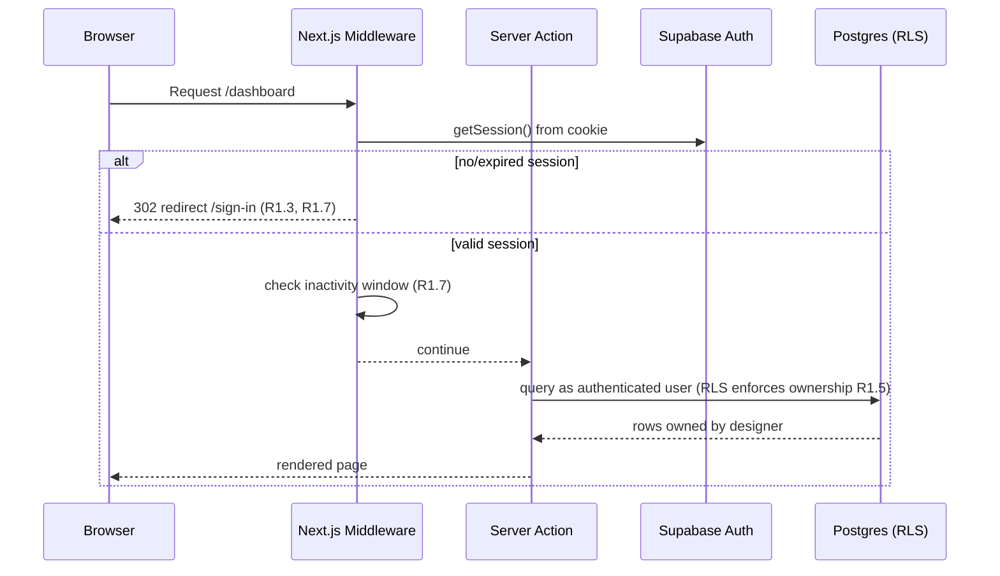
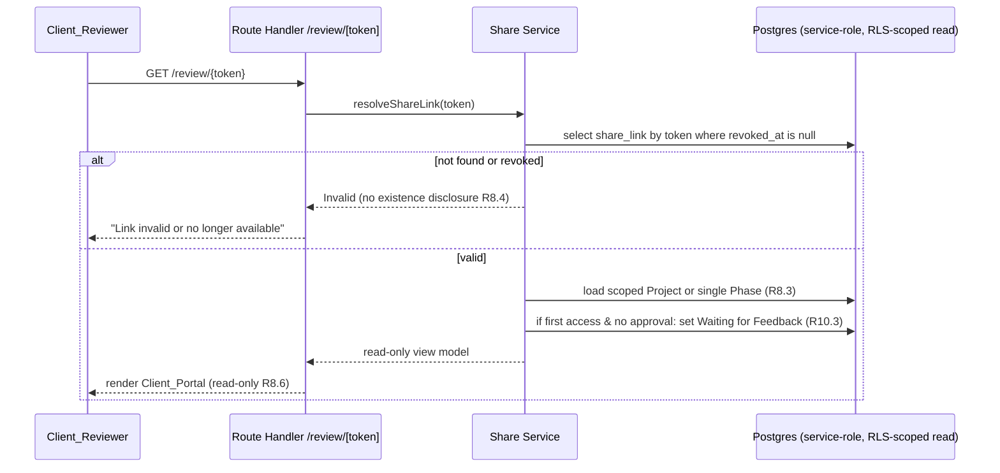
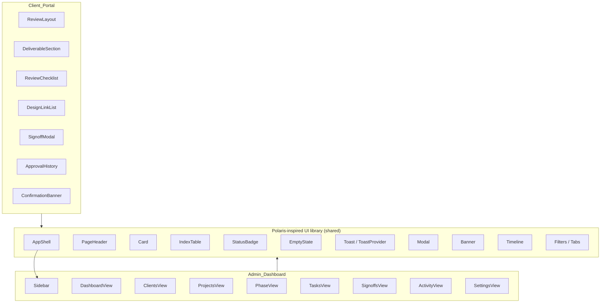
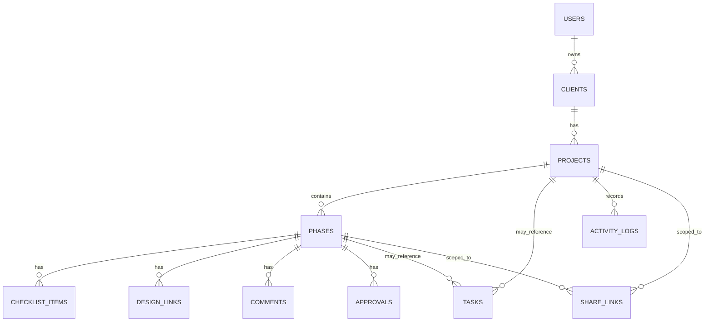

# Design Document

## Overview

The Client Sign-Off Dashboard is a Next.js (App Router) application written in TypeScript, styled with Tailwind CSS, and backed by Supabase (PostgreSQL, Auth, Storage). It serves two distinct audiences from one codebase:

- **Admin_Dashboard** — an authenticated, Polaris-inspired admin experience used by the **Designer** to manage clients, projects, phases, checklist items, design links, comments, approvals, tasks, and activity. It uses a persistent left sidebar, top action bar, and card-based content.
- **Client_Portal** — an unauthenticated, single-column review page reached through a private **Share_Link**. A **Client_Reviewer** reviews the shared project or phase in read-only mode and submits an approval or change request after entering their name and initials.

The design is organized around three pillars:

1. **A typed service layer** that holds all business logic (validation, phase status transitions, overdue computation, dashboard aggregation, share-link issuance, approval snapshots). This layer is pure and side-effect-isolated so it is directly unit- and property-testable.
2. **A persistence layer** built on Supabase Postgres with strict foreign keys, cascade-delete behavior, and Row Level Security (RLS) that enforces "designer owns their data" and "unauthenticated share-link access is read-only and scoped."
3. **A presentation layer** consisting of a reusable Polaris-inspired component library shared between the admin and portal surfaces, plus responsive layout primitives.

This document specifies the architecture, components, data models, correctness properties, error handling, security model, and testing strategy. It addresses all 17 requirements. References to requirements use the form `R{n}.{m}` (for example, `R10.6`).

### Design Goals and Key Decisions

| Decision | Rationale | Requirements |
|---|---|---|
| Centralize business logic in a pure service/domain layer, separate from Supabase I/O | Makes validation, status lifecycle, overdue logic, and aggregation deterministic and property-testable; keeps UI thin | R1–R13, R17 |
| Use Supabase RLS as the authoritative authorization boundary, not just app code | Defense in depth: even a flawed route cannot leak another designer's data | R1.5, R4.8, R8.3, R17 |
| Model share-link access as a separate, server-validated read path that bypasses the user session but never the scope check | Client_Reviewer is unauthenticated yet must be tightly scoped and read-only | R8, R9, R15 |
| Store the checklist completion snapshot inside each Approval row (denormalized JSON) | Approvals are an immutable audit record; snapshot must not drift when checklist items later change | R9.4, R9.5, R17.6 |
| Compute the Overdue indicator as a derived flag, never as a stored Phase_Status value | Requirement explicitly states Overdue must not overwrite the workflow status | R10.6, R10.7 |
| Append-only `activity_logs` with no UPDATE/DELETE grants | Enforces audit immutability and 7-year retention at the database layer | R13.6, R13.7 |

## Architecture

### System Context



### Layered Architecture



The dependency rule is one-directional: Presentation → Application → Domain → Infrastructure. The Domain layer has **no** Supabase imports; it operates on plain TypeScript types and is injected with repository interfaces. This is what makes property-based testing practical: domain functions can be exercised with thousands of generated inputs and in-memory fakes.

### Technology Stack

- **Framework:** Next.js App Router. Server Components render data-heavy admin views; Client Components handle interactivity (modals, toasts, forms, sidebar toggle).
- **Language:** TypeScript (strict mode). Domain types shared across server and client.
- **Styling:** Tailwind CSS with a small design-token layer (CSS variables) encoding the Polaris-inspired palette, radii, borders, and spacing scale.
- **Backend:** Supabase — Postgres for data, Auth (email/password) for the Designer, Storage for design-file uploads.
- **Data access:** `@supabase/supabase-js` and `@supabase/ssr` for cookie-based session handling in the App Router. A server-only **service-role client** is used exclusively for the share-link read/write path (which must work without a user session) and is never exposed to the browser.
- **Validation:** Zod schemas at the boundary, delegating to pure domain validators so the same rules run in tests.
- **Property testing:** `fast-check` with Vitest.

### Rendering and Routing Strategy

- Admin pages are protected by Next.js middleware that checks the Supabase session and redirects unauthenticated requests to `/sign-in` (R1.3). Middleware also refreshes the session cookie.
- The Client_Portal route (`/review/[token]`) is fully public at the routing layer; authorization is performed server-side by validating the share-link token and applying scope (R8.2, R8.3, R8.4).
- Mutations use **Server Actions** for admin operations and **Route Handlers** for (a) file uploads (multipart streaming, size enforcement) and (b) the share-link read/sign-off path used by the unauthenticated portal.

### Authentication & Session Flow



Lockout (R1.6) and inactivity timeout (R1.7) are handled in the application/domain layer on top of Supabase Auth:

- **Lockout:** A `auth_attempts` tracking mechanism counts consecutive failures per account within a rolling 15-minute window. After 5 failures the account is locked for 15 minutes; sign-in attempts during lockout are rejected with a generic "temporarily locked" message before credentials are ever checked against Supabase.
- **Inactivity timeout:** The session records a `last_activity_at` timestamp (server-side, in an `httpOnly` cookie/session record). Middleware terminates sessions idle for 30 minutes and forces re-authentication.

### Share-Link Access Flow



## Components and Interfaces

### Component Map



### Polaris-Inspired Component Library

These components implement the visual language in R14 and R15 and the responsive behavior in R16. They are presentation-only and receive data via props.

| Component | Responsibility | Requirements |
|---|---|---|
| `AppShell` | Frame for admin: persistent left sidebar + top header region + main content area; manages collapsed/expanded sidebar state persisted to `localStorage`; collapses to a toggle below 1024px | R14.1, R16.1–R16.4 |
| `Sidebar` | Navigation entries: Dashboard, Clients, Projects, Tasks, Sign-offs, Activity, Settings | R14.1 |
| `PageHeader` | Top header bar with page title and the page's primary action | R14.2 |
| `Card` | White/light-grey surface, subtle rounded corners, soft borders, compact spacing | R14.3 |
| `IndexTable` | Simple, responsive table for list views; no horizontal overflow 320–1920px (stacks/condenses columns on narrow widths) | R2.5, R3.8, R11.2, R16.5 |
| `StatusBadge` | Maps each of the 7 statuses + Overdue to one fixed label and one fixed, visually distinct color, used everywhere a status appears | R14.4, R11.7 |
| `EmptyState` | Empty-state message + relevant primary action | R2.6, R4.2, R5.6, R11.3, R13.5, R14.5 |
| `Toast` / `ToastProvider` | Confirmation toast on create/edit/delete, visible ≥ 4s or until dismissed | R14.6 |
| `Modal` | Confirm/cancel dialog; used for delete confirmation and the sign-off form | R14.7, R14.8, R15.5, R17.4 |
| `Banner` | Inline status/error/notice messaging (e.g., invalid link, storage failure) | R6.5, R8.4, R8.6 |
| `Timeline` | Vertical chronological activity list | R11.6, R13.4 |
| `Filters` / `Tabs` | Optional filtering/segmenting on list views | R14 (supporting) |

A single `StatusBadge` mapping table is the source of truth for status presentation (see Data Models → Status presentation map), ensuring consistency across every view (R14.4).

### Admin Views

| View | Route | Responsibility | Requirements |
|---|---|---|---|
| Dashboard | `/dashboard` | Summary cards, project status table, Waiting-on-client, My-next-tasks, recent activity timeline | R11 |
| Clients | `/clients`, `/clients/[id]` | List/create/edit/delete clients; project counts; empty states | R2, R17.4, R17.7 |
| Projects | `/projects`, `/projects/[id]` | List/create/edit projects; default phase initialization | R3 |
| Phase detail | `/projects/[id]/phases/[phaseId]` | Edit phase fields; manage checklist items, design links, comments; view approvals; complete phase | R4, R5, R6, R7, R10.8, R10.9 |
| Tasks | `/tasks` | Create/complete tasks; ordered open task list | R12 |
| Sign-offs | `/sign-offs` | Generate/revoke share links; view approval audit trail | R8, R9.7 |
| Activity | `/activity`, per-project timeline | Activity log timeline view | R13 |
| Settings | `/settings` | Account/session settings | R1 (supporting) |

### Client Portal

| Component | Responsibility | Requirements |
|---|---|---|
| `ReviewLayout` | Centered single-column layout, no admin sidebar, no horizontal overflow 320–1920px | R15.1, R16.6 |
| Header block | Project title + current phase title at the top, above all content | R15.2 |
| `DeliverableSection` | Labeled statement of the specific deliverable being approved | R15.3 |
| `ReviewChecklist` | Read-only checklist items with completion states | R9.1 |
| `DesignLinkList` | Selectable design links/files that open the referenced URL or file | R6.7, R9.1 |
| Comment input | Allows a Client_Reviewer to add a comment through a valid link | R7.2, R9.1 |
| Approve / Request-changes controls | Primary (approve) + secondary (request changes) actions, two separate controls | R15.4 |
| `SignoffModal` | Modal with name (1–100) + initials (1–10) inputs and an official-record statement | R9.2, R9.3, R15.5, R15.6 |
| `ApprovalHistory` | Approval history in reverse chronological order: decision, name, timestamp | R9.8 |
| `ConfirmationBanner` | Confirmation message stating recorded decision, name, timestamp | R9.6 |

### Application Layer: Server Actions and Route Handlers

All admin mutations run as authenticated Server Actions; each calls a domain function for validation/logic, then a repository for persistence, then records activity where required. Signatures (abbreviated):

```ts
// Clients (R2, R17.4, R17.7)
createClient(input: { name: string }): Promise<Result<Client, ValidationError>>
updateClient(id: string, input: { name: string }): Promise<Result<Client, ValidationError>>
deleteClientCascade(id: string): Promise<Result<void, AppError>> // requires confirmed modal

// Projects (R3)
createProject(input: { name: string; clientId: string }): Promise<Result<Project, ValidationError>>
updateProject(id: string, input: { name: string }): Promise<Result<Project, ValidationError>>

// Phases (R4, R10)
updatePhase(id: string, input: PhaseEditInput): Promise<Result<Phase, ValidationError>>
addPhase(projectId: string, title: string): Promise<Result<Phase, AppError>>
completePhase(id: string): Promise<Result<Phase, AppError>> // only if Approved (R10.9)

// Checklist (R5)
addChecklistItem(phaseId: string, text: string): Promise<Result<ChecklistItem, ValidationError>>
updateChecklistItem(id: string, patch: { text?: string; complete?: boolean }): Promise<Result<ChecklistItem, ValidationError>>
deleteChecklistItem(id: string): Promise<Result<void, AppError>>

// Design links + uploads (R6) — upload is a Route Handler for streaming/size enforcement
addDesignLinkUrl(phaseId: string, url: string): Promise<Result<DesignLink, ValidationError>>
// POST /api/phases/[phaseId]/files  (multipart, 50MB cap)
deleteDesignLink(id: string): Promise<Result<void, AppError>>

// Comments (R7)
addComment(phaseId: string, text: string, author: Author): Promise<Result<Comment, ValidationError>>

// Tasks (R12)
createTask(input: { title: string; projectId?: string; phaseId?: string; dueDate?: string }): Promise<Result<Task, ValidationError>>
completeTask(id: string): Promise<Result<Task, AppError>>

// Share links (R8)
generateShareLink(scope: { type: 'project' | 'phase'; id: string }): Promise<Result<ShareLink, AppError>>
revokeShareLink(id: string): Promise<Result<void, AppError>>

// Dashboard (R11)
getDashboard(): Promise<DashboardViewModel>
```

Unauthenticated portal endpoints (Route Handlers using the server-only service-role client, with scope enforced in code and read-only by construction):

```ts
// GET  /review/[token]            -> resolveShareLink + scoped read-only view model (R8.2, R8.3)
// POST /review/[token]/comments   -> addComment as Client_Reviewer (R7.2, R7.5)
// POST /review/[token]/signoff    -> submitApproval (R9.4, R9.5, R9.9)
```

```ts
// Result type used across the application layer
type Result<T, E> = { ok: true; value: T } | { ok: false; error: E };
```

### Domain Layer (pure, testable)

```ts
// Validation (R2, R3, R4, R5, R6, R7, R9, R12)
validateClientName(raw: string): Result<string, ValidationError>;        // trim -> 1..100
validateProjectName(raw: string): Result<string, ValidationError>;       // trim -> 1..120
validateChecklistText(raw: string): Result<string, ValidationError>;     // trim -> 1..500
validateCommentText(raw: string): Result<string, ValidationError>;       // trim -> 1..5000
validateDescription(raw: string): Result<string, ValidationError>;       // <= 5000
validateDesignUrl(raw: string): Result<string, ValidationError>;         // http/https, <= 2048
validateSignoff(name: string, initials: string): Result<Signoff, ValidationError>; // 1..100 / 1..10
validateTaskTitle(raw: string): Result<string, ValidationError>;         // trim -> 1..200
isProjectNameDuplicate(name: string, siblings: Project[]): boolean;      // case-insensitive (R3.5)

// Phase status state machine (R10)
type PhaseStatus = 'Draft' | 'Sent to Client' | 'Waiting for Feedback'
  | 'Changes Requested' | 'Approved' | 'Completed';
nextStatusOnShare(s: PhaseStatus): PhaseStatus;          // -> Sent to Client (R10.2)
nextStatusOnFirstAccess(s: PhaseStatus, hasApproval: boolean): PhaseStatus; // R10.3
nextStatusOnApproval(decision: ApprovalDecision): PhaseStatus;             // R10.4/10.5
canComplete(s: PhaseStatus): boolean;                    // only Approved (R10.8/10.9)
isOverdue(dueDate: Date | null, status: PhaseStatus, now: Date): boolean;  // R10.6/10.7

// Ordering & aggregation (R2.5, R3.8, R11, R12.4, R13.4)
sortClientsByName(cs: Client[]): Client[];               // case-insensitive asc
sortProjectsByName(ps: Project[]): Project[];            // case-insensitive asc
sortOpenTasks(ts: Task[]): Task[];                       // due asc, null-due last
buildDashboard(state: WorkspaceSnapshot, now: Date): DashboardViewModel;

// Share-link issuance (R8.1)
generateToken(rng: RandomSource): string;                // >= 32 chars, URL-safe

// Approval snapshot (R9.4/9.5, R17.6)
buildApproval(input: SignoffInput, checklist: ChecklistItem[], now: Date): Approval;
```

## Data Models

### Entity-Relationship Overview



### TypeScript Domain Types

```ts
type UUID = string;
type ISODate = string;       // 'YYYY-MM-DD'
type ISOTimestamp = string;  // UTC ISO-8601

type ApprovalDecision = 'Approved' | 'Changes Requested';
type PhaseStatus =
  | 'Draft' | 'Sent to Client' | 'Waiting for Feedback'
  | 'Changes Requested' | 'Approved' | 'Completed';

interface Client { id: UUID; ownerId: UUID; name: string; createdAt: ISOTimestamp; }

interface Project {
  id: UUID; clientId: UUID; ownerId: UUID; name: string; createdAt: ISOTimestamp;
}

interface Phase {
  id: UUID; projectId: UUID;
  title: string; ordinal: number;
  description: string;        // <= 5000
  internalNotes: string;      // <= 5000
  status: PhaseStatus;        // never 'Overdue' (Overdue is derived)
  dueDate: ISODate | null;
  approvedByName: string | null;
  approvedInitials: string | null;
  approvedAt: ISOTimestamp | null;
  createdAt: ISOTimestamp;
}

interface ChecklistItem {
  id: UUID; phaseId: UUID; text: string; complete: boolean; createdAt: ISOTimestamp;
}

interface DesignLink {
  id: UUID; phaseId: UUID;
  kind: 'url' | 'file';
  url: string | null;          // for kind 'url'
  storagePath: string | null;  // for kind 'file'
  fileName: string | null;
  createdAt: ISOTimestamp;
}

type Author =
  | { type: 'designer'; userId: UUID }
  | { type: 'reviewer'; name: string };

interface Comment {
  id: UUID; phaseId: UUID;
  authorType: 'designer' | 'reviewer';
  authorUserId: UUID | null;
  authorName: string | null;
  text: string;               // 1..5000
  createdAt: ISOTimestamp;     // UTC
}

interface Approval {
  id: UUID; phaseId: UUID;
  decision: ApprovalDecision;
  reviewerName: string;        // 1..100
  reviewerInitials: string;    // 1..10
  checklistSnapshot: Array<{ checklistItemId: UUID; text: string; complete: boolean }>;
  createdAt: ISOTimestamp;     // UTC approval timestamp
}

interface Task {
  id: UUID; ownerId: UUID;
  title: string;               // 1..200
  state: 'open' | 'complete';
  projectId: UUID | null;
  phaseId: UUID | null;
  dueDate: ISODate | null;
  createdAt: ISOTimestamp;
}

type ActivityType =
  | 'comment_created' | 'approval_created' | 'phase_status_changed';

interface ActivityLog {
  id: UUID; projectId: UUID;
  type: ActivityType;
  actor: string;               // designer email or reviewer name
  detail: Record<string, unknown>; // e.g., { from, to } or { decision, name }
  createdAt: ISOTimestamp;     // second-level precision, UTC
}

interface ShareLink {
  id: UUID; ownerId: UUID;
  token: string;               // >= 32 chars, unique
  scopeType: 'project' | 'phase';
  projectId: UUID | null;
  phaseId: UUID | null;
  revokedAt: ISOTimestamp | null;
  firstAccessedAt: ISOTimestamp | null;
  createdAt: ISOTimestamp;
}
```

### Database Schema (PostgreSQL / Supabase)

```sql
-- Designer accounts mirror Supabase auth.users (1:1)
create table public.users (
  id uuid primary key references auth.users(id) on delete cascade,
  email text not null unique,
  created_at timestamptz not null default now()
);

create table public.clients (
  id uuid primary key default gen_random_uuid(),
  owner_id uuid not null references public.users(id) on delete cascade,
  name text not null check (char_length(btrim(name)) between 1 and 100),
  created_at timestamptz not null default now()
);
create index on public.clients (owner_id);

create table public.projects (
  id uuid primary key default gen_random_uuid(),
  client_id uuid not null references public.clients(id) on delete cascade,
  owner_id uuid not null references public.users(id) on delete cascade,
  name text not null check (char_length(btrim(name)) between 1 and 120),
  created_at timestamptz not null default now()
);
create index on public.projects (client_id);
-- Case-insensitive uniqueness of project name within a client (R3.5)
create unique index projects_client_name_ci
  on public.projects (client_id, lower(btrim(name)));

create table public.phases (
  id uuid primary key default gen_random_uuid(),
  project_id uuid not null references public.projects(id) on delete cascade,
  title text not null,
  ordinal int not null,
  description text not null default '' check (char_length(description) <= 5000),
  internal_notes text not null default '' check (char_length(internal_notes) <= 5000),
  status text not null default 'Draft'
    check (status in ('Draft','Sent to Client','Waiting for Feedback',
                      'Changes Requested','Approved','Completed')),
  due_date date,
  approved_by_name text,
  approved_initials text,
  approved_at timestamptz,
  created_at timestamptz not null default now(),
  unique (project_id, ordinal)
);
create index on public.phases (project_id);

create table public.checklist_items (
  id uuid primary key default gen_random_uuid(),
  phase_id uuid not null references public.phases(id) on delete cascade,
  text text not null check (char_length(btrim(text)) between 1 and 500),
  complete boolean not null default false,
  created_at timestamptz not null default now()
);
create index on public.checklist_items (phase_id, created_at);

create table public.design_links (
  id uuid primary key default gen_random_uuid(),
  phase_id uuid not null references public.phases(id) on delete cascade,
  kind text not null check (kind in ('url','file')),
  url text check (url is null or char_length(url) <= 2048),
  storage_path text,
  file_name text,
  created_at timestamptz not null default now(),
  check ((kind = 'url' and url is not null and storage_path is null)
      or (kind = 'file' and storage_path is not null))
);
create index on public.design_links (phase_id);

create table public.comments (
  id uuid primary key default gen_random_uuid(),
  phase_id uuid not null references public.phases(id) on delete cascade,
  author_type text not null check (author_type in ('designer','reviewer')),
  author_user_id uuid references public.users(id),
  author_name text,
  text text not null check (char_length(btrim(text)) between 1 and 5000),
  created_at timestamptz not null default now()
);
create index on public.comments (phase_id, created_at);

create table public.approvals (
  id uuid primary key default gen_random_uuid(),
  phase_id uuid not null references public.phases(id) on delete cascade,
  decision text not null check (decision in ('Approved','Changes Requested')),
  reviewer_name text not null check (char_length(btrim(reviewer_name)) between 1 and 100),
  reviewer_initials text not null check (char_length(btrim(reviewer_initials)) between 1 and 10),
  checklist_snapshot jsonb not null,
  created_at timestamptz not null default now()
);
create index on public.approvals (phase_id, created_at desc);

create table public.tasks (
  id uuid primary key default gen_random_uuid(),
  owner_id uuid not null references public.users(id) on delete cascade,
  title text not null check (char_length(btrim(title)) between 1 and 200),
  state text not null default 'open' check (state in ('open','complete')),
  project_id uuid references public.projects(id) on delete cascade,
  phase_id uuid references public.phases(id) on delete cascade,
  due_date date,
  created_at timestamptz not null default now()
);
create index on public.tasks (owner_id, state, due_date);

create table public.activity_logs (
  id uuid primary key default gen_random_uuid(),
  project_id uuid not null references public.projects(id) on delete cascade,
  type text not null check (type in ('comment_created','approval_created','phase_status_changed')),
  actor text not null,
  detail jsonb not null default '{}'::jsonb,
  created_at timestamptz not null default now()
);
create index on public.activity_logs (project_id, created_at desc);

create table public.share_links (
  id uuid primary key default gen_random_uuid(),
  owner_id uuid not null references public.users(id) on delete cascade,
  token text not null unique check (char_length(token) >= 32),
  scope_type text not null check (scope_type in ('project','phase')),
  project_id uuid references public.projects(id) on delete cascade,
  phase_id uuid references public.phases(id) on delete cascade,
  revoked_at timestamptz,
  first_accessed_at timestamptz,
  created_at timestamptz not null default now(),
  check ((scope_type = 'project' and project_id is not null and phase_id is null)
      or (scope_type = 'phase' and phase_id is not null))
);
create unique index on public.share_links (token);
```

### Cascade-Delete Behavior (R17.4, R17.7)

Deleting a Client deletes all dependent records through `on delete cascade` foreign keys: `clients → projects → phases → {checklist_items, design_links, comments, approvals, share_links}`, plus `tasks` and `activity_logs` referencing those projects/phases. The cascade chain is enforced at the database layer so partial deletion cannot occur (R17.9). Stored design files in Supabase Storage are removed by the application as a post-delete step (see Error Handling), because Postgres cascade cannot reach object storage.

### Row Level Security (RLS) Policies

RLS is enabled on every table. Two access modes:

**1. Designer (authenticated, `auth.uid()` present).** Owner-scoped on every table (R1.5, R4.8).

```sql
alter table public.clients enable row level security;
create policy clients_owner on public.clients
  using (owner_id = auth.uid()) with check (owner_id = auth.uid());

alter table public.projects enable row level security;
create policy projects_owner on public.projects
  using (owner_id = auth.uid()) with check (owner_id = auth.uid());

-- Child tables authorize via their parent's owner.
alter table public.phases enable row level security;
create policy phases_owner on public.phases
  using (exists (select 1 from public.projects p
                 where p.id = phases.project_id and p.owner_id = auth.uid()))
  with check (exists (select 1 from public.projects p
                      where p.id = phases.project_id and p.owner_id = auth.uid()));
-- Analogous owner-via-parent policies for checklist_items, design_links,
-- comments, approvals (via phase->project), tasks, activity_logs, share_links.
```

**2. Client_Reviewer (unauthenticated, via Share_Link).** The portal path uses a **server-only service-role client** that bypasses RLS, so scope and read-only enforcement live in the share service code rather than in RLS (because the reviewer has no `auth.uid()` to scope on). The service:

- Loads the share link by token where `revoked_at is null`; otherwise returns the generic invalid response (R8.4).
- Restricts the result set to the scoped Project (all its phases) or the single scoped Phase (R8.3).
- Permits only two write operations — insert a `comment` (author_type `reviewer`) and insert an `approval` — both tied to the resolved, in-scope phase. No update/delete paths exist for the reviewer (R8.6, R9.10).

`activity_logs` is **append-only**: no UPDATE or DELETE policy is granted to any role, enforcing audit immutability (R13.7). Retention (R13.6) is operational: no scheduled job deletes audit rows, and approvals/comments inherit the same retention.

### Default Phase Initialization (R3.7)

On project creation the service inserts the 10 default phases in order, each `status = 'Draft'`, with `ordinal` 1..10:

```
1 Discovery · 2 Brief sign-off · 3 Sitemap · 4 Wireframes · 5 UI design
6 Content · 7 Development · 8 Testing · 9 Launch · 10 Handover
```

### Status Presentation Map (R14.4)

A single constant maps each status (plus the derived Overdue indicator) to one fixed label and one fixed, visually distinct color token. All views render badges through this map (R11.7).

| Status value | Label | Color token |
|---|---|---|
| `Draft` | Draft | grey |
| `Sent to Client` | Sent to Client | blue |
| `Waiting for Feedback` | Waiting for Feedback | indigo |
| `Changes Requested` | Changes Requested | amber |
| `Approved` | Approved | green |
| `Completed` | Completed | teal |
| (derived) Overdue flag | Overdue | red |

The Overdue indicator is a derived flag rendered as an additional badge; it never replaces the workflow `status` value (R10.6).

## Correctness Properties

*A property is a characteristic or behavior that should hold true across all valid executions of a system — essentially, a formal statement about what the system should do. Properties serve as the bridge between human-readable specifications and machine-verifiable correctness guarantees.*

These properties target the pure domain layer (validation, the phase-status state machine, overdue computation, ordering, dashboard aggregation, token generation, share-link resolution, approval construction, and audit invariants). Each is universally quantified and intended to be implemented as a single property-based test running at least 100 iterations. UI rendering, layout/responsiveness, infrastructure FK/cascade behavior, and timing criteria are validated by example, integration, snapshot, and smoke tests instead (see Testing Strategy).

### Property 1: Client name validation

*For any* string, `validateClientName` accepts it if and only if the string has length 1 to 100 after trimming leading and trailing whitespace, and when accepted it returns the trimmed value; when rejected, no client field is mutated.

**Validates: Requirements 2.1, 2.2, 2.3, 2.4**

### Property 2: Project name validation

*For any* string, `validateProjectName` accepts it if and only if the trimmed length is 1 to 120, returning the trimmed value; otherwise it rejects and identifies the name violation.

**Validates: Requirements 3.1, 3.2, 3.4**

### Property 3: Project name duplicate detection

*For any* set of sibling projects under a client and any candidate name, `isProjectNameDuplicate` returns true if and only if some sibling's name equals the candidate after trimming and case-folding both.

**Validates: Requirements 3.5**

### Property 4: Project edit preserves phases

*For any* project with any set of phases and any valid new name, editing the project's name leaves the project's phase set (identities, ordinals, and contents) unchanged.

**Validates: Requirements 3.6**

### Property 5: Default phase initialization

*For any* newly created project, its phases are exactly the ten defaults — Discovery, Brief sign-off, Sitemap, Wireframes, UI design, Content, Development, Testing, Launch, Handover — assigned ordinals 1 through 10 in that order, each with status `Draft`.

**Validates: Requirements 3.7, 10.1**

### Property 6: Appended phase ordinal and status

*For any* project with an existing set of phases, adding a phase yields a new phase whose ordinal is greater than every existing ordinal (last position) and whose status is `Draft`.

**Validates: Requirements 4.6, 10.1**

### Property 7: Phase partial-update invariant

*For any* phase and any valid edit patch over description, internal notes, and due date, applying the patch changes exactly the patched fields and leaves all unedited fields unchanged.

**Validates: Requirements 4.4**

### Property 8: Phase field validation

*For any* description string, internal-notes string, and due-date value, the phase validator accepts if and only if both text fields are at most 5,000 characters and the due date is a valid calendar date (or absent); on rejection the stored phase values are retained.

**Validates: Requirements 4.5**

### Property 9: Checklist text validation and default state

*For any* string, `validateChecklistText` accepts it if and only if its trimmed length is 1 to 500; an accepted newly created checklist item has completion state incomplete; rejection leaves existing checklist items unchanged.

**Validates: Requirements 5.1, 5.2, 5.7**

### Property 10: Checklist display ordering

*For any* set of checklist items belonging to a phase, the display order is non-decreasing by creation timestamp (ascending).

**Validates: Requirements 5.5**

### Property 11: Design URL validation

*For any* string, `validateDesignUrl` accepts it if and only if it parses as a URL using the http or https scheme and its length does not exceed 2048 characters; otherwise no design link is created.

**Validates: Requirements 6.1, 6.2**

### Property 12: Upload size limit

*For any* file size in bytes, `isWithinUploadLimit` is true if and only if the size is at most 50 MB; a rejected upload creates no design link.

**Validates: Requirements 6.3, 6.4**

### Property 13: Comment text validation and attribution

*For any* string and any author, `validateCommentText` accepts it if and only if its trimmed length is 1 to 5,000; an accepted comment is attributed to the submitting author (designer or reviewer) with a UTC creation timestamp.

**Validates: Requirements 7.1, 7.2, 7.3, 7.4**

### Property 14: Comment display ordering

*For any* set of comments on a phase, the display order is non-decreasing by creation timestamp (oldest to newest).

**Validates: Requirements 7.6**

### Property 15: Share-link token generation

*For any* sequence of token generations, every produced token has length at least 32, uses only URL-safe characters, and all tokens in the sequence are pairwise distinct.

**Validates: Requirements 8.1**

### Property 16: Share-link access predicate

*For any* share link in any state, the link is accessible if and only if it exists and its `revokedAt` is null; an accessible link resolves to a read-only view model and a revoked or nonexistent link is inaccessible.

**Validates: Requirements 8.2, 8.5**

### Property 17: Phase-scoped link isolation

*For any* phase-scoped share link, resolving the link yields exactly the one in-scope phase, and any request for a different phase or any project through that link is denied.

**Validates: Requirements 8.3**

### Property 18: Invalid-link response indistinguishability

*For any* nonexistent token and any revoked token, the response produced when resolving the link is identical, disclosing nothing about whether an associated project or phase exists.

**Validates: Requirements 8.4**

### Property 19: Reviewer view-only authorization

*For any* operation requested through a share link, the operation succeeds only if it is adding a comment or submitting an approval against the in-scope phase of a valid (existing, non-revoked) link; every other operation — including any modify, delete, or out-of-scope create, and any write through an invalid or revoked link — is rejected as view-only and produces no state change.

**Validates: Requirements 7.5, 8.6, 9.9, 9.10**

### Property 20: Sign-off validation

*For any* name and initials strings, `validateSignoff` accepts if and only if the name's trimmed length is 1 to 100 and the initials' trimmed length is 1 to 10; on rejection it identifies each invalid field and retains the entered values.

**Validates: Requirements 9.2, 9.3, 15.6**

### Property 21: Approval construction and snapshot

*For any* valid sign-off input (decision in {Approved, Changes Requested}, valid name and initials) and any set of checklist items, `buildApproval` produces an approval that stores the decision, name, initials, associated phase identifier, a UTC timestamp, and a checklist snapshot whose entries equal the completion state of every checklist item at sign-off time; if any required field is missing or empty, no approval is produced.

**Validates: Requirements 9.4, 9.5, 17.6**

### Property 22: Approval history ordering

*For any* set of approvals for a phase, the approval history is ordered non-increasing by approval timestamp (reverse chronological).

**Validates: Requirements 9.8**

### Property 23: Phase status transitions

*For any* phase status, the transition functions hold: sharing yields `Sent to Client`; first reviewer access with no existing approval yields `Waiting for Feedback`; an approval with decision Approved yields `Approved`; an approval with decision Changes Requested yields `Changes Requested`.

**Validates: Requirements 10.2, 10.3, 10.4, 10.5**

### Property 24: Overdue computation

*For any* due date, phase status, and current time, `isOverdue` is true if and only if the current date is strictly later than the due date and the status is neither `Approved` nor `Completed`; computing the overdue flag never mutates the stored phase status, and any phase whose status is `Approved` or `Completed` is never overdue.

**Validates: Requirements 10.6, 10.7, 11.7**

### Property 25: Phase completion guard

*For any* phase status, `completePhase` succeeds and yields status `Completed` if and only if the current status is `Approved`; otherwise it is rejected and the existing status is retained.

**Validates: Requirements 10.8, 10.9**

### Property 26: Dashboard summary counts

*For any* workspace snapshot and current time, the dashboard summary counts equal, and are computed consistently with, the counts recomputed directly from the snapshot — active projects (at least one non-Completed phase), phases Waiting for Feedback, overdue phases, and open tasks — and every count is non-negative.

**Validates: Requirements 11.1**

### Property 27: Project status table aggregation

*For any* workspace snapshot, the project status table contains exactly the active projects, and for each row the latest comment is the most recent comment across the project's phases by creation timestamp, the next action is the title of the project's open task with the earliest due date (or the "No next action" sentinel when none exists), with associated client name, current phase, status, and due date.

**Validates: Requirements 11.2, 11.3**

### Property 28: Waiting-on-client filter

*For any* workspace snapshot, the Waiting-on-client section contains exactly the phases whose status is `Sent to Client` or `Waiting for Feedback`.

**Validates: Requirements 11.4**

### Property 29: Open-task ordering

*For any* set of tasks, the open-task list contains only open tasks ordered by ascending due date, with tasks that have no due date listed after all tasks that have a due date.

**Validates: Requirements 11.5, 12.3, 12.4**

### Property 30: Activity timeline ordering and limit

*For any* set of activity-log entries and any limit N, the timeline view returns the N most recent entries ordered non-increasing by creation timestamp (reverse chronological), where N is 20 for the dashboard recent-activity view and 50 for the per-project timeline.

**Validates: Requirements 11.6, 13.4**

### Property 31: Task title validation and default state

*For any* string, `validateTaskTitle` accepts it if and only if its trimmed length is 1 to 200; an accepted newly created task has state `open`; rejection retains the entered values.

**Validates: Requirements 12.1, 12.2**

### Property 32: Change-request creates a task

*For any* approval submitted with decision Changes Requested, exactly one open task is created for the designer referencing the affected phase.

**Validates: Requirements 12.5**

### Property 33: Activity logging on events

*For any* comment, approval, or phase-status change, a corresponding activity-log entry is produced for the associated project: a comment yields a `comment_created` entry carrying event type, actor, and timestamp; an approval yields an `approval_created` entry carrying decision, reviewer name, and timestamp; a status change yields a `phase_status_changed` entry carrying previous status, new status, and timestamp.

**Validates: Requirements 13.1, 13.2, 13.3**

### Property 34: Audit immutability

*For any* attempt to modify or delete an activity-log, comment, or approval audit entry, the attempt is rejected, the original entry is preserved unchanged, and an immutability indication is returned.

**Validates: Requirements 7.8, 9.7, 9.10, 13.7**

### Property 35: Ownership authorization

*For any* designer and any owned resource (client, project, phase, or descendant) with an owner, access and mutation are permitted if and only if the requesting designer is the owner; in particular a non-owner cannot edit a phase's internal notes.

**Validates: Requirements 1.5, 4.8**

### Property 36: Status presentation map totality and distinctness

*For all* phase status values and the derived Overdue indicator, the status presentation map returns exactly one label and one color token, the mapping is deterministic, and the assigned color tokens are pairwise distinct across statuses.

**Validates: Requirements 14.4**

## Error Handling

The application uses a uniform `Result<T, E>` discipline in the domain and application layers; exceptions are reserved for truly exceptional infrastructure faults. Errors are categorized and surfaced through Polaris-inspired patterns (inline field messages, `Banner`, `Toast`).

### Error Categories

| Category | Examples | Surface | Requirements |
|---|---|---|---|
| Validation errors | Empty/too-long client/project/checklist/comment/task text; bad URL; invalid sign-off; invalid due date | Inline field message; entered values retained | R2.2, R2.4, R3.2–R3.5, R4.5, R5.7, R6.2, R7.3, R7.4, R9.3, R12.2, R15.6 |
| Authentication errors | Invalid credentials; account locked; expired/idle session | Generic auth `Banner` (no field disclosure); redirect to sign-in | R1.2, R1.3, R1.6, R1.7 |
| Authorization errors | Non-owner access; reviewer write attempt; revoked/invalid link | View-only `Banner`; generic invalid-link message | R4.8, R8.4, R8.6, R9.9 |
| Upload errors | File > 50 MB; storage write/delete failure | `Banner` with explicit cause; no design link created | R6.4, R6.5 |
| Persistence errors | DB write failure; FK violation (missing parent) | `Banner` describing failed operation; no partial commit | R17.2, R17.3, R17.9 |
| Conflict errors | Duplicate project name under client | Inline field message | R3.5 |

### Transactional Integrity (R17.9)

All multi-row mutations (project creation with default phases, client cascade delete, approval-plus-task-plus-activity-log writes) execute inside a single database transaction (via a Postgres function/RPC where multiple statements are involved). If any statement fails, the transaction rolls back so no partial changes are committed and affected records remain in their prior state; the action returns a descriptive error. Storage file removal during client delete is performed after the DB transaction commits; if a file deletion fails, the DB state is already consistent and the failure is logged and surfaced without rolling back the (already committed) record deletion.

### Upload Failure Handling (R6.3–R6.6)

File uploads are size-checked before transfer where the client reports size, and enforced server-side during streaming (the Route Handler aborts and rejects once the 50 MB threshold is crossed). A design link row is created only after the storage write confirms success; if storage fails, no row is written (R6.5). On design-link deletion, the file is removed from storage for file-backed links only (R6.6).

### Authentication Edge Handling (R1.2, R1.6, R1.7)

- Invalid credentials always yield the same generic message regardless of which field was wrong (R1.2).
- The lockout check runs before credential verification; during a lockout window all attempts return the generic "temporarily locked" message (R1.6).
- Idle sessions beyond 30 minutes are terminated by middleware before the request reaches a protected handler (R1.7).

### Share-Link Failure Handling (R8.4)

Nonexistent and revoked tokens produce a byte-identical "invalid or no longer available" response with no signal about the existence of an underlying project or phase (Property 18). Writes attempted through such links are rejected with no state change (Property 19).

## Security Considerations

| Concern | Control | Requirements |
|---|---|---|
| Designer data isolation | RLS owner-scoped policies on every table; child tables authorize via parent ownership; app-layer ownership predicate as a second gate | R1.5, R4.8 |
| Route protection | Next.js middleware validates Supabase session and redirects unauthenticated requests; protected Server Actions re-check session | R1.3 |
| Brute-force resistance | Per-account lockout after 5 failures in 15 minutes; generic error messages avoid field/account enumeration | R1.2, R1.6 |
| Session hygiene | `httpOnly`, `Secure`, `SameSite` cookies via `@supabase/ssr`; 30-minute idle termination; sign-out invalidates session | R1.4, R1.7 |
| Unauthenticated portal exposure | Service-role client used only server-side and never shipped to the browser; share resolution enforces scope and read-only in code; only comment/approval inserts permitted | R8.2, R8.3, R8.6 |
| Token unpredictability | Cryptographically secure RNG produces ≥ 32-char URL-safe tokens; uniqueness enforced by a DB unique constraint | R8.1 |
| Information disclosure | Invalid/revoked links return an indistinguishable generic response | R8.4 |
| Audit integrity | `activity_logs` is append-only (no UPDATE/DELETE grants); approvals/comments are never deleted; 7-year retention with no purge job | R13.6, R13.7, R7.8, R9.7 |
| Input safety | Zod + domain validation at every boundary; URL scheme allow-list (http/https) for design links; React output escaping; parameterized queries via Supabase client | R6.1, R6.2, R7, R9 |
| Upload abuse | 50 MB server-enforced size cap; storage objects scoped to owner paths | R6.3, R6.4 |

The Client_Portal is intentionally unauthenticated; its security rests entirely on token secrecy plus server-side scope and read-only enforcement. This is called out explicitly because it is the one network-exposed surface without a login: no endpoint reachable by a reviewer can mutate anything beyond inserting a comment or approval on the in-scope phase.

## Testing Strategy

The feature is well-suited to property-based testing because its core is a set of pure functions and deterministic transformations (validators, the phase-status state machine, overdue computation, ordering, dashboard aggregation, token generation, share-link resolution, approval construction). PBT applies to that domain layer. Infrastructure concerns (FK enforcement, cascade delete, transactional rollback, Supabase Auth, Storage), UI rendering, and responsive layout are not property-based and use the complementary strategies below.

### Dual Testing Approach

- **Property tests** verify the universal properties above across many generated inputs.
- **Unit/example tests** verify specific behaviors, attribution, and error messaging.
- **Component tests** verify rendering, empty states, modals, toasts, and the Client_Portal composition.
- **Integration tests** verify FK constraints, cascade delete, transactional atomicity, Supabase Auth, and Storage wiring with 1–3 representative cases each.
- **Smoke tests** verify schema presence and one-time configuration.
- **Visual/responsive tests** verify no horizontal overflow from 320px to 1920px.

### Property-Based Testing Requirements

- Library: **fast-check** with **Vitest**.
- Do not implement property-based testing from scratch; use the library's generators and runners.
- Each correctness property (1–36) is implemented as a **single** property-based test.
- Each property test runs a **minimum of 100 iterations** (`fc.assert(..., { numRuns: 100 })` or higher).
- Each property test is tagged with a comment referencing its design property using the format:
  `// Feature: client-sign-off-dashboard, Property {number}: {property_text}`
- Generators must exercise edge inputs: empty strings, all-whitespace strings, boundary lengths (0, 1, max, max+1), Unicode, near-boundary due dates (day before/of/after), null due dates, mixed-case names, revoked/expired links, empty collections, and large collections.

### Example, Integration, and Smoke Coverage (non-PBT criteria)

| Strategy | Criteria covered |
|---|---|
| Example/unit | R1.2, R1.3, R3.3, R5.3, R5.4, R6.5, R6.6, R6.7, R9.1, R9.6, R14.1, R14.2, R14.5–R14.8, R15.1–R15.5, R16.1–R16.4, R17.4, R17.5, R17.8 |
| Integration | R1.1, R1.4, R17.2, R17.3, R17.7, R17.9 |
| Smoke | R13.6, R14.3, R16.5, R16.6, R17.1 |
| Component empty-state/edge | R2.6, R4.2, R5.6, R7.7, R13.5 |

### Test Data and Isolation

- Domain property/unit tests run fully in-memory against repository fakes — no Supabase dependency, enabling fast 100+ iteration runs.
- Integration tests run against a local Supabase instance with migrations applied and are seeded per test, then rolled back or truncated to isolate cases.
- Storage and Auth integration tests use a dedicated test bucket and test accounts; they assert wiring with a small number of representative cases rather than exhaustive iteration.

### Traceability

Every requirement is covered by at least one test: testable-as-property criteria map to Properties 1–36; the remaining criteria map to the example/integration/smoke/component tests enumerated above. Property tags link each test back to its design property, and each property lists the requirements it validates, closing the loop from requirement → property → test.
